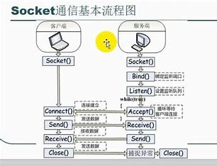
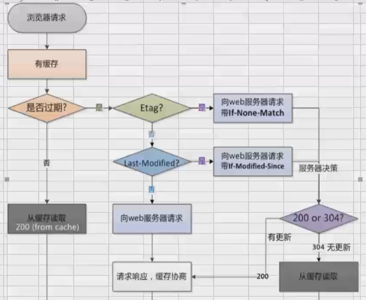

#MyNote

##C#基础

<details>
<summary><b>枚举</b></summary>

将枚举声明到命名空间的下面，类的外面，表示这个命名空间下所有的类都可以使用这个枚举。

> public enum 枚举名
> {
> ,
> ,
> 最后一行可以不写逗号
> }

    public:访问修饰符，公开的，哪都可以访问。
    private：私有的，只能在这个类内部进行访问。默认修饰为private
    enum：声明枚举的关键字。

枚举:规范开发。本质还是变量
枚举的类型默认可以和 int 类型互相转换 == 枚举类型和 int 型是兼容的。

```csharp
    public enum MyEnum
    {
        // x = 5,
        yu = 0,
        asdf = 1,
    }
```

```csharp
    public enum Gender
    {
        male,
        female
    }
```

```csharp
//枚举类型强转为int
MyEnum at = MyEnum.x;
int ad = (int)at;
Console.WriteLine(ad);
Console.WriteLine((int)MyEnum.yu);

//int类型强转为枚举
int c = 13;
MyEnum ap = (MyEnum)c;
Console.WriteLine(ap);

//枚举转string
MyEnum aq = MyEnum.yu;
string e = aq.ToString();
Console.WriteLine(e);

//string转枚举
string f = "5";
MyEnum ae = (MyEnum)Enum.Parse(typeof(MyEnum),f);
Console.WriteLine(ae);
```

</details>

<details>
<summary><b>结构</b></summary>

结构：可以帮助我们一次声明多个不同类型的变量

> [public] struct 结构名
> {
> 成员：字段
> }

```csharp
    public struct Person
    {
        public string _firstname; //字段（下划线）
        public string _lastname;
        public int _age;
        public Gender _gender;
    }
```

```csharp
Person zs;
zs._firstname = "张";
zs._lastname = "三";
zs._age = 19;
zs._gender = Gender.male;
```

</details>

<details>
<summary><b>类</b></summary>

> public class 类名

    {
         字段;
         属性;
         方法;
         构造函数;
         析构函数;
    }

写好一个类之后，需要创建这个类的对象，这个过程称为类的实例化
创建对象：
类名 名 = new 类名();

    this：
    1.表示当前这个类的对象
    2.在类当中显式的调用本类的构造函数-------> :this

</details>
<details>
<summary><b>占位符及控制输出精度</b></summary>

`decimal money = 1000m;`

| 占位符 | 作用                  |
| ------ | --------------------- |
| {:n}   | 000,000,000           |
| {:c}   | ￥符号                |
| {:e}   | 科学计数法            |
| {:f4}  | 小数点后四位          |
| {:x}   | 十六进制 `x2`加零对齐 |
| {:p}   | 百分号                |
| {:f}   | 不显示秒              |
| {:y}   | 年月                  |
| {:m}   | 月日                  |
| {:d}   | 2020-1-1              |
| {:t}   | 14:34                 |

```csharp
Console.WriteLine("{0:p}",0.3);//------30.00%
Console.WriteLine("{0:}",DateTime.Now);//---->0:控制输出位数
```

`var yin_shi_lei_xing = 1.23;`
var:根据等式右边自动推算类型

C# 是一门强类型语言：必须对每一个变量的类型一个明确的定义
js 是弱类型语言：不需要对变量的类型有明确的定义

可空类型：类型关键字? 属 Nullable<T>
在 C#代码中用添加前缀“0x”的方式表示十六进制

`Console.WriteLine("{0:0.00\a}",a);`
\a:产生“嘀”的一声蜂鸣
\f:换行

```csharp
//保留两位小数（四舍五入）
int[] num = { 4,7,9 };
double avg = GetAvg(num);
string s = avg.ToString("0.00");
avg = Convert.ToDouble(s);
Console.WriteLine(avg);
Console.ReadKey();
```

序列化：将对象转换为二进制
反序列化：将二进制转换为对象
作用：传输数据（二进制）

</details>

<details>
<summary><b>try-catch</b></summary>

```csharp
//判断是否为闰年
int year, month, day;
Console.WriteLine("请输入年份：");
try
{
   year = Convert.ToInt32(Console.ReadLine());
   Console.WriteLine("请输入月份：");
   try
   {
       month = Convert.ToInt32(Console.ReadLine());
       switch (month)
       {
           case 1:
           case 3:
           case 5:
           case 7:
           case 8:
           case 10:
           case 12:
               Console.WriteLine("这个月有31天");
               break;
           case 2:
               if (year % 400 == 0 || (year % 4 == 0 && year % 100  != 0))
               {
                   Console.WriteLine("这个月有28天");
               }
               else
               {
                   Console.WriteLine("这个月有29天");
               }
               break;
           default:
               Console.WriteLine("这个月有30天");
               break;
       }
   }
   catch
   {
       Console.WriteLine("输入的月份有误");
   }
}
catch
{
   Console.WriteLine("输入的年份有误");
}
```

</details>

<details>
<summary><b>类型转换</b></summary>

```csharp
int year = Convert.ToInt32(Console.ReadLine());
Console.WriteLine(year);
bool tb = int.TryParse(Console.ReadLine(), out a);
Console.WriteLine(a);
```

</details>

<details>
<summary><b>产生随机数</b></summary>

```csharp
Random r = new Random();
int rNub = r.Next(1, 10+1);
Console.WriteLine(rNub);
```

</details>

<details>
<summary><b>数组</b></summary>

```csharp
//初始化方式
int[] nums = new int[10];
int[] nums2 = { 1, 2, 3, 4, 5, 6, 7, 8, 9, 10 };
int g = nums2.Max();
Console.WriteLine(g);
for (int i = 0; i < nums2.Length; i++)
{
    Console.WriteLine(nums2[i]);
}
```

```csharp
//冒泡排序：
int[] num = { 9, 8, 7, 6, 5, 4, 3, 2, 1, 0 };
int temp;
for (int i = 0; i < num.Length-1; i++)
{
   for (int j = 0; j < num.Length-1-i; j++)
   {
       if (num[j]>num[j+1])//升序排列
       {
           temp = num[j];
           num[j] = num[j + 1];
           num[j + 1] = temp;
       }
   }
}
```

```csharp
Array.Sort(num);//针对数组做一个升序的排列
Array.Reverse(num);//逆转排列数组
for (int i = 0; i < num.Length; i++)
{
   Console.WriteLine(num[i]);
}
```

</details>

<details>
<summary><b>三个高级参数：out、ref、params</b></summary>

out 参数

> 在一个方法中返回多个不同类型的值：
> `public static void 方法名（int ,out int,out double,out string）`

ref 参数

> 能够将一个参数带入一个方法中进行改变，改变完成后再将改变后值带出方法
> `public static void 方法名（ref int,ref int）`

params 参数

> 将实参列表中跟可变参数数组类型一致的元素都当作数组的元素里。
> 必须是参数列表之中的最后一个元素
> `public static void 方法名（int ,params int[] num）`

</details>

<details>
<summary><b>重载</b></summary>

方法的重载

> 方法的名称相同，但传递的参数不同

分为两种情况：

> 1.参数的个数相同，那么参数的类型就不能相同 2.参数的类型相同，那么参数的个数就不能相同

方法的重载和返回值没有关系

</details>

<details>
<summary><b>位运算</b></summary>

1 .&运算符
`&` 是二元运算符，它以特定的方式的方式组合操作数中对应的位 果对应的位都为 1，那么结果就是 1， 如果任意一个位是 0 则结果就是 0
`1 & 3` 的结果为 `1`
来看看它的怎么运行的：
1 的二进制表示为 `0 0 0 0 0 0 1`
3 的二进制表示为 `0 0 0 0 0 1 1`
根据 & 的规则 得到的结果为 `0 0 0 0 0 0 0 1`,十进制表示就是 1

只要任何一位是 0 `&` 运算的结果就是 0，所以可以用 `&` 把某个变不必要的位设为 0, 比如某个变量的二进制表示为 `0 1 0 0 1 0 0 1`, 我想保留低 4 位，消除高 4 位 用 `&0x0F` 就可以了（注：`0x0F` 为 16 制表示法，对应的二进制为 `0 0 0 0 1 1 1 1`），这个特性在编码使用很广泛。

2 、| 运算符
`|` 跟 `&` 的区别在于 如果对应的位中任一个操作数为 1 那么结果是 1
`1 | 3` 的结果为 `3`

3、 ^运算符
`^` 运算符跟 `|` 类似，但有一点不同的是 如果两个操作位都为 1 话，结果产生 0
`0 1 0 0 0 0 0 1` ^ `0 1 0 1 1 0 1 0` 产生 `0 0 0 1 1 0 1 1`

4 、~运算符
`~`是对位求反 1 变 0， 0 变 1

5 、移位运算符移位运算符把位按指定的值向左或向右移动
<< 向左移动 而 >> 向右移动，超过的位将丢失，而空出的位则补 0
如
`0 1 0 0 0 0 1 1`(十进制 67) 向左移动两位 `67 << 2` 将变成
`0 0 0 0 1 1 0 0` （十进制 12）当然如果你用 java 代码写，由是 32 位，不会溢，结果是 268
向右移动两位 `67 >> 2` 则是
`0 0 0 1 0 0 0 0`(十进制 16)

前面提到 2 向前移动 1 位变成 4 利用这个特性可以做乘法运算(在不虑溢出和符号位的情况下)
`2 << 1 = 4`
`3 << 1 = 6`
`4 << 1 = 8`

同理 `>>` 则可以做除法运算
任何小数 把它 `>> 0` 可以取整
如 `3.14159 >> 0 = 3`;

```csharp
int a = 5, b = 9;
Console.WriteLine(a & b);
Console.WriteLine(a | b);
Console.WriteLine(a ^ b);

// 交换变量
a = a ^ b;
b = b ^ a;
a = a ^ b;
Console.WriteLine("a=" + a + " b=" + b);
a = a & (~a); //a 清零
Console.WriteLine(a);
a = a | (~a); //a 全为 1
Console.WriteLine(a);
```

输出结果
1
13
12
a=9 b=5
0
-1

</details>

<details>
<summary><b>方法</b></summary>

方法：

> [public（访问修饰符）]static 返回值类型 方法名（[参数列表]）
> {方法体;
> }

`static`:静态的
返回值类型（如果不需写返回值，写 `void`）
方法名：Pascal 命名法(首字母大写)
参数列表：提供给这个方法的条件（括号不能省略）
`return`：返回要返回的值；立即结束方法；
方法改变数组的顺序，元素的位置和大小不需要返回值

</details>

<details>
<summary><b>WinForm</b></summary>

> 多线程操作控件：
>
> 1. 取消跨线程访问限制
>
> ```csharp
> CheckForIllegalCrossThreadCalls = false;
> ```
>
> 2. 开启多线程
>
> ```csharp
> if(control.InvokeRequired){
>   this.Invoke(new Action(() => {
>       //在子线程中执行Action委托
>   }))
> }
> ```

</details>

<details>
<summary><b>XAML</b></summary>

**容器**

1. StackPanel
   默认垂直排列，通过修改`orientation="Horizonal/Vertical"`
2. WrapPanel
   可以自动换行
3. DockPanel
   控件设置`DockPanel.Dock="Left/Top/Right/Bottom"`
   默认最后一个元素会填充满 `LastChildFill="false"`
4. Grid
   相当于表格

先定义行列数

```xml
<Gird.RowDefinition>
	<RowDefinition Height="Auto"/>
	...
</Gird.RowDefinition>
<Grid.ColumnDefinition>
	<ColumnDefinition/>
	...
</Grid.ColumnDefinition>
```

添加内容时，定义属性`Grid.Row/Column="..."`
自适应宽高是以元素为准

5. Canvas
   通过固定坐标设置元素位置(少用)

**样式**
全局样式，表示为所有【类型】的【名称】的控件添加了样式

```xml
<Window.Resources>
	<Style x:Key="名称" TargetType="类型">
		<Setter Property="FontSize" Value="20"/>
	</Style>
</Window.Resources>
```

给元素设置样式：
`<Button Style="{StaticResource 名称}"/>`
可以通过`BasedOn="{SatticResource ...}"`继承样式

**触发器**

```xml
<Style.Trigger>
	<Trigger Property="事件名" Value="True">
		<Setter/>
	</Trigger>
</Style.Trigger>
```

多条件：

```xml
<Style.Trigger>
	<MultiTrigger>
		<MultiTrigger.Conditions>
			<Condition Property="事件名1" value="True"/>
			<Condition Property="事件名2" value="True"/>
		</MultiTrigger.Conditions>
		<MultiTrigger.Setters>
			<Setter Property="" Value=""/>
		</MultiTrigger.Setters>
	</MultiTrigger>

</Style.Trigger>
```

**事件触发器**

```xml
<EventTrigger RoutedEvent="Mouse.MouseDown">
		<EventTrigger.Actions>
			<BeginStoryBoard>
				<StroyBoard>
					<DoubleAnimation Duration="0:0:0.2" Storyboard.TargetProperty="Foreground" To="Red">
				</StroyBoard>
			</BeginStoryBoard>
		<EventTrigger.Actions>
</EventTrigger>
```

**模板**
没有在模板中定义的原有属性会失效

**绑定**

- 通过元素名

```xml
<Slider x:Name="Slider"/>
 		<TextBox Text="{Binding ElementName=Slider, Path=Value, Mode=Default}"/>
```

- 绑定到非元素上
- `Source`指向一个数据源

```xml
<TextBox Text="{Binding Source={StaticResource text1}, Path=Text}"/>
```

使用`RelativeSource`对象 查找源对象

```xml
<TextBox Text="{Binding Path=属性名, RelativeSource={RelativeSourceMode=FindAncestor, AncestorType={x:Type 控件名}}}">
```

**DataContext**

`DataGrid` 绑定 `IEnumerable、DataTable.DefaultView`

`DataContext`

</details>

<details>
<summary><b>GDI绘图</b></summary>

基本流程：

```csharp
using(BitMap map = new BitMap(300, 400))
{
  using(Graphics g = new Graphics.FromImage(map))
  {
      //在清除颜色的同时填充背景色
      g.Clear(Color.Red);
      map.Save(string fileName)
  }
}
```

```csharp
// 创建GDI对象
Graphics pic = this.CreateGraphics();
// 创建画笔对象
Pen pen = new Pen(Brushes.Goldenrod);
// 创建两点坐标
Point p1 = new Point(30, 50);
Point p2 = new Point(100, 120);
// 画直线：
pic.DrawLine(pen, p1, p2);
// 画扇型：
pic.DrawPie();
// 画文本字符串
pic.DrawString("",new font(),Brushes.Black,new point());
// 将画布保存为一张图片

```

</details>

##数据库

<details>
<summary><b>Ado.Net</b></summary>

**三大范式**

- 原子性
- 一张表只描述一个对象
- 每一列和主键直接相关

**无限极分类**
表分为两张：_分类表_ 和 _信息表_

1. 父表存储`typeId` 子表中存储`parentId`
2. 增加标头 01 一级、0101 二级、010101 三级 查询时，like'01%'一级分类的所有子类

**负载均衡**
多个数据库存储的内容一样
中间层服务器 `DBMS`

读 => 负载均衡
写 => 基于触发器，写完第一个库之后根据日志写其他的库，全部完成之后返回
适合做查询，同步效率不能保证，中间层挂了全部挂

**读写分离**
二八原则：**二写八读**
写数据很麻烦，读写分离降低压力
主数据库写入之后直接返回，从数据库再完成更新

日志传送：从数据库根据日志完成数据更新(有延迟)

快照复制(定时复制传输) 即时性差、不适合大批量修改、适合做报表

事务复制：
发布服务器--主数据库
订阅服务器--从数据库
复制代理

**分库分表**

- 垂直分表：将多余的属性分出去(占空间、更新少、查询少 的数据)
- 水平分表：按时间分表(实时性数据)、地域拆分、类别分表、唯一标识分表
- 表分区：数据库提供，按条件将一张表的数据拆分为不同文件

- 垂直分库：按业务区分、多个服务器分担压力，一个程序同时访问多个数据库(通过服务的形式)，事务=>最终一致性
- 水平分库：多个库结构一样、按时间地域等区分

**原子性**

- 一张表只描述一个对象
- 每一列和主键直接相关

**数据库连接过程**
`Connnection`对象
非托管资源
应用程序---->数据库
地址 连接指定数据库 用户名 密码
连接字符串：告诉 `Connection` 对象连接的数据库地址、名称、用户名和密码
连接本机 `"Data Source=.;"`
忘了字符串
1、拼接连接字符串的工具

```csharp
SqlConnectionStringBuilder
SqlConnectionStringBuilder scsb = new SqlConnectionStringBuilder();
scsb.DataSource = ".";
scsb.UserID = "sa";//用户名
scsb.InitialCatalog = "Student";//数据库名称
scsb.Password = "12345678";
string scsbStr = scsb.ToString();
//使用Windows身份登录
scsb.IntegratedSecurity = true;
scsbStr = "Data Source=.;Initial Catalog=CyberCampus";
//2、服务器资源管理器
//Data Source =.; Initial Catalog = Student; Persist Security Info = True; User ID = sa; Password = ***********
//创建Connetion对象
using (SqlConnection sc = new SqlConnection(scsbStr))
{
    //sc.StateChange += sc_StateChange;
    if (sc.State == ConnectionState.Closed)
    {
        sc.Open();//必须open
    }
    string sql = "select * from Student";
    //string sql = string.Format("select * from Spassword where Sno='{0}' and Spassword = '{1}'", textBoxImportAdmin.Text, textBoxImportPsw.Text);
    //SQL注入漏洞攻击：
    //构造恶意的Password: 'or'1'='1
    //防范注入漏洞攻击的方法：不使用SQL语句拼接，通过参数赋值(不使用''单引号)------>用户输入的时候使用
    //string sql = "select * from [Student] where Sno = @Sname and Spassword = @Password"
    //在执行查询语句之前，给参数赋值(自动加''单引号)
    //cmd.Parameters.AddWithValue("@Sno" , textboxAdm.Text);
    //cmd.Parameters.AddWithValue("@Password" , textboxPwd.Text);
    //这不是简单的字符串替换，而是由SQLServer（查询分析器）直接用添加的值进行数据比较
    //创建SqlCommand对象执行sql语句
    //SqlCommond cmd = con.CreateCommand()
    using (SqlCommand cmd = new SqlCommand(sql, sc))
    {
        //写在构造函数中==  ：
        //cmd.Connection = sc; ;
        //cmd.CommandText = sql;
        cmd.CommandType = CommandType.Text;
        //要执行的是非查询语句(ExecuteNonQuery)：
        int influencedR = cmd.ExecuteNonQuery();
        if (influencedR > 0)
        {
            Console.WriteLine("插入成功！");
        }
        //ExecuteScalar方法(返回单个值):
        object result = cmd.ExecuteScalar();
        //Console.WriteLine(result);
        //ExecuteReader方法：
        using (SqlDataReader reader = cmd.ExecuteReader())
        {
            //SqlReader在过程中必须独享一个Connection（不能断开）
            while (reader.Read())//如果下一条有数据则继续执行==reader.HasRows
            {
                //reader["列名"]
                //Console.WriteLine(reader.GetString(0));
                //获取索引的方法：reader.GetOrdinal("列名")------------>最规范
                //Console.WriteLine(reader.GetString(reader.GetOrdinal("学号")) );
                string 姓名 = reader.GetString(reader.GetOrdinal("姓名"));
                string 性别 = reader.GetString(reader.GetOrdinal("性别"));
                DateTime 出生日期 = reader.GetDateTime(reader.GetOrdinal("出生日期"));
                string 班级 = reader.GetString(reader.GetOrdinal("班级"));
                string QQ号 = reader.GetString(reader.GetOrdinal("QQ"));
                if (reader["职务"] != DBNull.Value)
                {
                    string 职务 = reader.GetString(reader.GetOrdinal("职务"));
                }
                int 四级成绩 = reader.GetInt32(reader.GetOrdinal("成绩"));
                string 籍贯 = reader.GetString(reader.GetOrdinal("籍贯"));
            }
        }
    }
    //Close内部判断，如果之前没有将sc连接关闭，则将其关闭，若关闭了则什么都不做
    //sc.Close();
    //sc.Dispose();
}
```

**ADO.Net 连接池**
在连接字符串 pooling = false 关闭连接池（默认打开）
每次正常连接数据库都会执行：1、登录数据库服务器 2、执行操作 3、注销用户
open 操作较为耗时

`Command`对象
托管资源
CommandText 属性表示要执行的 SQL 语句
常用的三个方法:

1. `ExecuteNonQuery()`
   执行非查询语句（增 `insert`、删 `delete`、改 `update`），返回受影响的行数,对其他语句(`select`)返回-1
2. `ExecuteScalar()`
   执行查询，返回首行首列
3. `ExecuteReader()`
   执行查询，返回 `DataReader` 对象
   `StatementCompleted`事件：每条 sql 语句执行后触发

`DataSet`
临时数据库(内存)---->(一次性全部读取，不需要一直保证数据库连接，用于小型数据的读取)
`SqlDataAdapter`
数据适配器---->用来填充 `DataSet`

```csharp
创建DataSet临时数据库，将数据显示在DataGridView中
DataSet ds = new DataSet("Student");
创建表
DataTable dt = new DataTable("Student");
把表添加到数据库中
ds.Tables.Add(dt);
设计列
DataColumn dc1 = new DataColumn("sID");
dc1.DataType = typeof();//数据类型
dc1.AllowDBNull = false;//不许为空
dc1.AutoIncrement = true;//自动增长
dc1.AutoIncrementSeed = 1;//种子大小
dc1.AutoIncrementStep = 1;//增量
DataColumn dc2 = new DataColumn("sName");
dc2.DataType = typeof(string);
把列添加到表中
dt.Columns.Add(dt1);
dt.Columns.Add(dt2);
添加每行数据
DataRow dr1 = dt.NewRow();
dr1["sName"] = "";
dt.Rows.Add(dr1);
还可以使用dt.Rows.InsertAt(DataRow, index);----------在表的指定位置插入
把DataTable中的数据传给DGV
DtaGridView对象.DataSource = dt
```

```csharp
using(SqlConnection con = new Sqlconnection(conStr))
{
    DataTable dt = new DataTable();
      // 1、查询
    string sql = "select * from Student";
    SqlDataAdapter adapter = newSqlDataAdapter(sql, con);
    adapter.Fill(dt);
      // 2、增删改
    string sql = "";
    SqlDataAdapter adapter = new SqlDataAdapter(sql, con);
    // 创建关键对象，可以自动生成sql语句(DGV手动修改数据)
    SqlCommandBuilder scb = new SqlCommandBuilder(adapter);
    adapter.Update(dt);
}
```

**数据库操作封装**
封装链接字符串
`app.config`
`Application.Configuration`(应用程序配置信息文件)
在这个 xml 文档中标签不能随便写

1. 添加节点

```xml
<connectionStrings>
  <add name="conStr" connectionString="Data Source=.;Initial Catalog=Student"/>
</connectionStrings>
```

2. 在指定项目中添加`System.Configuration`的引用
3. 添加命名空间`using System.Configuration`;
4. `ConfigurationManager.ConnectionStrings["conStr"].ConnnectionString;`
   返回 string 连接字符串

封装连接数据库的步骤：

1. 新建类库
2. 删除 `class1.cs`
3. 添加 `System` 引用，引用命名空间
4. 封装连接字符串
5. 将 `class` 标记为 `public`
6. 读取连接字符串 `string conStr = ConfigurationManager.ConnectionStrings["conStr"].connectionString;`

**封装操作方法**
查询函数

```csharp
//  1、静态SqlDataAdapter查询函数:
public static DataTable ExecuteDataTable(string sql, CommandType type, params SqlParameter[] param)
{
    DataTable dt = new DataTable();
    using (SqlConnection con = new SqlConnection(conStr))
    {
        SqlDataAdapter adapter = new SqlDataAdapter(sql, con);
        adapter.SelectCommand.CommandType = type;
        adapter.SelectCommand.Parameters.Clear();
        adapter.SelectCommand.Parameters.AddRange(param);
        adapter.Fill(dt);
    }
    return dt;
}
```

静态增删改函数

```csharp
// 2、静态增删改函数
public static int ExecuteNonQuery(string sql, params SqlParameter[] param)
{
    int n = -1;
    using (SqlConnection con = new SqlConnection(conStr))
    {
        using (SqlCommand cmd = new SqlCommand(sql, con))
        {
            con.Open();
            cmd.Parameters.Clear();
            cmd.Parameters.AddRange(param);
            n=cmd.ExecuteNonQuery();
        }
    }
    return n;
}
```

查询首行首列

```csharp
// 3、执行查询，返回首行首列
public static object ExecuteScalar(string sql, params SqlParameter[] param)
{
    object o = null;
    using (SqlConnection con = new SqlConnection(conStr))
    {
        using (SqlCommand cmd = new SqlCommand(sql, con))
        {
            con.Open();
            cmd.Parameters.Clear();
            cmd.Parameters.AddRange(param);
            o = cmd.ExecuteScalar();
        }
    }
    return o;
}
```

装载 DataReader

```csharp
// 4、DataReader
public static SqlDataReader ExecuteReader(string sql, params SqlParameter[] param)
{
    SqlDataReader reader;
    SqlConnection con = new SqlConnection(conStr);
    using (SqlCommand cmd = new SqlCommand(sql, con))
    {
        con.Open();
        cmd.Parameters.Clear();
        cmd.Parameters.AddRange(param);
    //在外部关闭SqlDataReader对象,CommandBehavior.CloseConnection：如果关闭SqlDataReader,则con随之关闭
        reader = cmd.ExecuteReader(CommandBehavior.CloseConnection);
    }
    return reader;
}

```

> `DataGridView`控件
> 读取每一个单元格数据：`DataGridView 对象.SelectedRows[0].Cells["属性名"].Value.ToString();` > `CellFormatting` 事件:对 dgv 进行格式化处理
> `CellContentDoubleClick` 事件:
> 通过创建 `DataGridViewRow 对象 = dgv.Rows[(DataGridViewCellEventArgs 类型参数)e.RowIndex]`
> 可以拿取到当前点击的行,再根据 `dgvRow.Cell[index].Value` 拿到对应的单元格
> `ComboBox` 控件：
> 绑定数据 `DataSource` 属性：`DataTable` 数据绑定时，传统的数据添加方式就失效了
> 设置要显示的内容 `DisplayMenber` 属性：`"列名/属性名"` > `ValueMember` 属性：`"列名/属性名"`
> 读取 `ValueMember` 属性的值：`comboBox 对象.SelectedValue`
> 多个控件同时操作同一个数据源会出问题，因此在第二个控件使用时需要将数据源进行拷贝 `DataTable 对象.Copy()`

**SQL**
**CASE**
单值判断，相当于 C#中的`switch-case`，原表中的数据并没有改变，替换值的类型必须一致
当进行区间判断时，不写列名

```sql
case 参数
  when 值 then 值
  when 值 then 值
  else 值
end
(as 列名)

if()
  begin
      语句1
  end
else
  begin
      语句2
  end

while()
  begin
      语句
      break
  end
```

**索引**
sql 语言创建索引：

```sql
create (nonclusteres/clustered) index on 表名 列名 asc/desc
```

默认主键含有一个聚簇/非聚簇索引
使用索引可以提高查询效率，但索引也要占据空间，增删改的时候也会同步更新索引因此降低速度
只在经常使用的字段上创建索引
全表扫描：一条条的找，效率最低
**_即使创建了索引，当存在 like、函数、类型时仍会进行全表扫描_**

**分页**
`row_number`函数
给一个结果集再加一个数据

```sql
row_number() over (order by 列名)
```

```sql
select * from
(select *,ROW_NUMBER() over (order by [列名]) as '' from Student) as t
where number between (2-1)*3+1 and 2*3
(x-1)*y+1             --x是页数，y是每一页的行数
x*y                   --x是页数，y是每一页的行数
```

**连接**
`[表名]   join  [表名]`

- 交叉连接`cross join`
  行数相乘，列数相加
- 内连接`inner join `
  把不符合条件的数据删除
- 外连接
  使用 `ON`、`USING` 或 `NATURAL` 关键字来表达
  1. `left join`
  2. `right join`

**视图**
虚拟表，储存的实际上为查询语句
能方便查询，不直接对其进行增删改
创建数据库(表、约束等)时做检查：

```sql
if exists(select * from sys.databases/sys.objects where name="名字")
  动作
go
```

**局部变量**
声明：`declare @变量名 数据类型`
赋值：`set @变量名=值`
`select @变量名=值`(查询并赋值，可以一次给多个变量赋值)
没有`GC`,但也会自动释放内存

全局变量
在前面加上`@@`

| 系统变量          | 含义                                             |
| ----------------- | ------------------------------------------------ |
| @@ERROR           | 最后一条 T-SQL 语句错误的错误号 0:并没有发生错误 |
| @@IDENTITY        | 最后一次插入的标识值                             |
| @@LANGUAGE        | 当前使用的语言                                   |
| @@MAX_CONNECTIONS | 可以创建的同时连接的最大数目                     |
| @@ROWCOUNT        | 受上一条 SQL 语句影响的行数                      |
| @@SERVERNAME      | 本地服务器的名称                                 |
| @@TRANCOUNT       | 当前连接打开的事务数                             |
| @@VERSION         | SQL Server 的版本信息                            |

**事务**
多个 SQL 语句作为一个整体执行
开始事务：`BEGIN TRANSACTION`
事务提交：`COMMIT TRANSACTION`
事务回滚：`ROLLBACK TRANSACTION`

一旦事务提交，就不能再回滚
没有`END`，事务最终只能被提交或回滚

`ACID`特性:

- 原子性：原子工作单元，对于数据修改一起执行(不执行)
- 一致性：事务在完成时，必须使所有数据都保持一致状态，所有规则都必须应用于事务的修改以保证数据的完整性
- 隔离性：由并发事务所做的修改必须与其他任何并发事务隔离
- 持久性：事务完成后对系统的影响是永久的，即使出现故障也一直保持

1、自动提交事务：当执行一条 SQL 语句的时候，数据库自动打开一个事务，执行成功则自动提交事务，否则自动回滚

2、隐式事务：

```sql
set implicit_transaction on/off
```

数据库自动打开一个事务，但是需要手动提交或回滚

3、显式事务：

```sql
begin transaction
  declare @sum int = 0
  [执行sql语句]
  统计错误次数：set @sum = @sum + @@ERROR
  if(@sum > 0)
      begin
          rollback  --如果出现错误则回滚
      end
  else
      begin
          commit  --如果没有发生错误则提交该事务
      end
```

高并发系统死锁不可避免
解决方案：

1. 按照固定顺序操作数据
2. 事务尽量简短，耗时越少越好
3. 不要在事务执行期间等待

**触发器**
特殊类型的存储过程
通过事件被触发而执行
主要有增、删、改(`insert`、`delete`、`update`)三种类型

```sql
create trigger tr_Insert_Student
on Student
  for insert
as
  declare @sutID int
  select @stuID = studentID from inserted
```

_备份_
创建删除触发器，在进行删除操作的时候将数据添加到备份表当中去

触发器对表进行备份

```sql
select * into [备份表名] from [表名]
create trigger tr_Delete_[表名]
on [表名]
for delete
as
  begin
      insert into [备份表名] select *from deleted
  end
```

**存储过程**
类似于方法
优点：

- 执行速度更快(保存的存储过程都是编译过的)
- 允许模块化程序设计(类似方法的复用)
- 提高系统安全性(防止恶意注入)
- 减少网络流通量(只传输存储过程的名称)

缺点：

- 不好维护
- 难以管理
- 逻辑分散不好理解

1、系统存储过程
由系统定义，存放在`master`数据库中，名称以`sp_`或`xp_`开头

| 名称                      | 作用                            |
| ------------------------- | ------------------------------- |
| sp_databases              | 列出服务器上所有的数据库        |
| sp_helpdb                 | 报告指定(所有)数据库的信息      |
| sp_renamedb               | 改名                            |
| sp_tables                 | 返回当前环境下可查询对象的列表  |
| sp_columns                | 返回某个表的列的信息            |
| sp_help(constraint/index) | 查看某个表的所有信息(约束/索引) |
| sp_stored_procedures      | 列出当前环境中所有存储过程      |
| sp_password               | 添加或修改登录账户的密码        |
| sp_helptext'存储过程名'   | 显示实际文本                    |

2、自定义存储过程
以`usp_`开头
在 C#中指定`cmd.CommandType = CommandType.StoredProcedure;`
`output`输出参数：`cmd.Parameters[参数index值].Direction = ParameterDirection.Output;`
运行时在语句前面加上`exec`
可以将表名作为参数传递
`exec(@sql)`
在 sql 中，`''`代表一个`'`

```csharp
// 创建一个参数对象,即为返回值
SqlParameter retVal = cmd.Parameters.AddWithValue("@count", SqlDbType.Int);
// 指定返回值
retVal.Direction = ParameterDirection.ReturnValue;
```

```sql
(create/drop/alter) (procedure/proc) usp_方法名
@参数1 类型 ,
@参数2 类型 --(output输出参数,调用时也应加上output)
as
  begin
      语句
      (return)
  end
```

外部调用存储过程：`exec @变量 = usp_方法名 参数列表`
调用存储过程时，如果有写 `变量=值` 的赋值语句，那么之后所有的参数都必须用同样的格式
使用`output` 的参数在调用时必须提前声明

**分页存储过程**

```sql
create proc GetPage
@pageSize int, --------每页有几行数据
@pageIndex int, --------当前页数
@pageTotalCount int output --------总页数
as
  declare @pageCount int --------总行数
  select @pageCount = count(*) from [表名]
  select @pageTotalCount = ceiling(@pageCount*1.0 / @pageSize) --------通过ceiling函数取整,返回总页数
  select * from
  (select *,ROW_NUMBER() over (order by [列名]) as '[结果列名]' from [表名]) as t
  where [结果列名] between ((@pageSize-1)*@pageIndex+1) and (@pageSize*@pageIndex)
```

**事务锁**

```sql
  begin trans
  update [表1] set = ;
  wait delay '0:0:5'
  update [表2] set = ;
  commit trans
```

在另一个进程：

```sql
  begin trans
  update [表2] set = ;
  wait delay '0:0:5'
  update [表1] set = ;
  commit trans
```

报错：事务(进程 ID 54)与另一个进程被死锁在 锁 资源上，并且已被选作死锁牺牲品。请重新运行该事务。

</details>

<details>
<summary><b>SQLite</b></summary>

**SQLite**数据库
是一种轻量级的数据库完全配置时小于 `400k`，省略可选功能配置时小于`250k`
不同于`SQlserver`的服务型数据库，而是一种文档型，可以在本机**离线**情况下使用
允许从多个进程或线程安全访问

注释：
`/*` `*/`或 `--`

**数据类型**

| 类型    | 解释                                                    |
| ------- | ------------------------------------------------------- |
| INTEGER | 带符号的整数                                            |
| REAL    | 8 字节的浮点数字                                        |
| TEXT    | 文本字符串，使用编码（UTF-8、UTF-16BE 或 UTF-16LE）存储 |
| BLOB    | 根据输入储存                                            |

亲和(`Affinity`)类型:
任何列仍然可以存储任何类型的数据，当数据插入时，该字段的数据将会优先采用亲缘类型作为该值的存储方式
`TEXT`、(`NUMERIC`、`INTEGER`、`REAL`)(基本等同)、`NONE`(不做任何类型转换)

链接字符串：
`@"Data Sourse = C:\SQLite\DATA\student.db3; Version = 3;"`

**sql 语法**

`ANALYZE` 语句
收集有关表和索引的统计信息，并将收集的信息存储在数据库的内部表中，查询优化器可以访问信息并使用它来帮助做出更好的查询计划选择
如果没有给出参数，则分析所有附加的数据库。如果模式名称作为参数给出，则分析该数据库中的所有表和索引。
如果参数是一个表名，那么只分析该表和与该表相关的索引。如果参数是索引名称，那么只分析那一个索引

`ATTACH DATABASE`
附加数据库

`ALTER TABLE`
给指定表改名

`EXPLAIN`
对指定 SQl 语句进行解释

`GLOB`
用来匹配通配符指定模式的文本值。如果搜索表达式与模式表达式匹配，`GLOB` 运算符将返回真（`true`），也就是 1
星号（`_`）代表零个、一个或多个数字或字符。问号（`?`）代表一个单一的数字或字符。这些符号可以被组合使用

`LIMIT`
用于限制由 `SELECT` 语句返回的数据数量
`SELECT _ FROM COMPANY LIMIT 6;`

`PRAGMA`
用在 `SQLite` 环境内控制各种环境变量和状态标志

</details>

<details>
<summary><b>MySQL</b></summary>

`MySQL`中的单行注释为`#`或者`--`空格
多行注释为`/**/`

使用`sql`语句导出将表格导出为`csv`文件(表格)

```sql
select * from course INTO OUTFILE 'D:/Program Files (x86)/MySQL/outfiles/table.csv'
 fields terminated by ',' enclosed by '"'
 lines terminated by '\r\n'
```

**声明全局变量**
会占用，非必要不使用
`SET @变量名 = 值;`
**局部变量**
在 `BEGIN`、`END` 中局部使用
`DECLARE 变量名 类型 [DEFAULT] 值;`

**存储过程**

````sql
  --( [] 表示可选)
  DROP PROCEDURE IF EXISTS 方法名;
  DELIMITER &&                                                      --定义局部换行分隔符
  CREATE PROCEDURE 方法名([IN 参数名, ..., OUT 参数名])
    BEGIN
    END&&
  DELIMITER;                                                        --将分隔符恢复为;```
````

调用存储过程
`CALL 方法名()`

执行预定义语句

```sql
PREPARE sqlStr FROM @sqlStr;
EXECUTE sqlStr;
DEALLOCATE PREPARE sqlStr;
```

**Node 连接 MySQL 的步骤**

1. 引入`mysql`模块
2. 创建连接

```javascript
mysql.createConncetion({
  host: "127.0.0.1",
  user: "root",
  password: "",
  database: "",
});
```

3. 执行 sql

```javascript
mysql.query(sql, (e, results) => {});
```

</details>

<details>
<summary><b>MongoDB</b></summary>

**MongoDB**
文档的增删查改用`mongoose`
操作 mongoDB 数据库本身用`mongodb`(Node.js MongoDB Driver)
`CRUD`(`Create`、`Read`、`Update`、`Delete`)

在 MongoDB 中没有关系数据中表的概念，而是集合(文档)，其具备多种属性
通过 Mongoose 模块中的 Schema 接口定义任务文档，然后声明属性
Mongoose 中的数据类型：
`String` `Number` `Date` `Boolean` `Buffer` `ObjectID` `Mixed` `Array`

**Node 操作 MongoDB**

```javascript
var mongoose = require("mongoose");
// 无需手动创建数据库
mongoose.connect("mongodb://localhost/todo_development", callback);
```

```javascript
var MongoClient = require("mongodb").MongoClient;
var dburl = "mongodb://localhost:27017/school";
//连接 或 创建数据库
MongoClient.connect(dburl, function (e, db) {
  if (!e) {
    console.log("conncet to mongodb");
  }
});
```

添加数据

```javascript
//添加数据
app.get("/add", function (req, res) {
  MongoClient.connect(dburl, function (e, client) {
    if (!e) {
      var db = client.db("school");
      //连接student集合并插入一条数据
      db.collection("student").insertOne(
        {
          name: "zs",
          sex: "m",
          age: 20,
        },
        function (e, result) {
          if (!e) {
            res.send("插入成功！");
          } else {
            console.log(e.message);
          }
        }
      );
    } else {
      console.log(e.message);
    }
  });
});
```

修改数据

```javascript
//修改数据
app.get("/edit", function (req, res) {
  MongoClient.connect(dburl, function (e, client) {
    if (!e) {
      var db = client.db("school");
      //连接student集合并插入一条数据
      db.collection("student").updateOne(
        {
          name: "李四",
        },
        {
          $set: {
            sex: "男",
          },
        },
        function (e, result) {
          if (!e) {
            res.send("修改成功！");
          } else {
            console.log(e.message);
          }
        }
      );
    } else {
      console.log(e.message);
    }
  });
});
```

删除数据

```javascript
//删除数据
app.get("/delete", function (req, res) {
  var query = url.parse(req.url, true).query;
  var name = query.name;
  MongoClient.connect(dburl, function (e, client) {
    if (!e) {
      var db = client.db("school");
      //连接student集合并插入一条数据
      db.collection("student").deleteOne(
        {
          name: name,
        },
        function (e, result) {
          if (!e) {
            res.send("删除成功！");
          } else {
            console.log(e.message);
          }
        }
      );
    } else {
      console.log(e.message);
    }
  });
});
```

查询数据

```javascript
//查询数据
app.get("/query", function (req, res) {
  MongoClient.connect(dburl, function (e, client) {
    if (!e) {
      var db = client.db("school");
      //用一个对象接受数据再循环输出
      var cursor = db.collection("student").find();
      var list = [];
      cursor.forEach((e, doc) => {
        if (!e) {
          if (doc != null) {
            list.push(doc);
          } else {
            res.send(list);
          }
        } else {
          console.log(e.message);
        }
      });
    } else {
      console.log(e.message);
    }
  });
});
```

</details>

<details>
<summary><b>PostGIS</b></summary>

1. 安装插件
   `CREATE EXTENSION postgis;`
2. 检查版本
   `postgis_full_version();`

基本类型转换 `type::newtype`

_使用`Bundle3`转换`shp`时注意不能使用中文路径_

**基本函数:**

返回几何类型
`SELECT ST_GeometryType(列名) from 表;`

维度
`ST_NDims();`

空间参照
`ST_SRID();`

返回几何的文本字符串（默认查询几何对象返回十六进制的坐标表示）
`ST_AsText()`

**基本几何对象:**

1. 点`Point`
   `ST_X` `ST_Y` `ST_Z` `ST_M`
2. 线串`Linestring`
   是否闭合
   `ST_IsClosed()`
   是否简单(不与自身交叉或接触)
   `ST_IsSimple()`
   长度
   `ST_Length()`
   起始/终止点坐标
   `ST_StartPoint() / ST_EndPoint()`
   构成坐标数
   `ST_NPoints()`
3. 多边形 `Polygon`

   面积
   `ST_Area()`

   环数
   `ST_NRings()`

   返回最外部环 `Linestring`
   `ST_ExteriorRing()`

   返回指定内环
   `ST_InteriorRingN(列名, n)`

   返回所有环周长
   `ST_Perimeter()`

4. 图形集合 `Collection`

   集合中组成部分的数量
   `ST_NumGeometries()`

   返回指定几何部分
   `ST_GeometryN(geom, n)`

**几何类型序列化和反序列化**
由于`SFSQL`定义的`WKT`和`WKB`不支持高维，postgis 定义了`EWKT`和`EWKB`
text 示例：`LINESTRING (Z/ZM) (0 1 2,3 4 12,3 345 23)`

1. WKT
   `ST_GeomFromText(text, srid)`
   `ST_AsEWKT(geom)`

2. WKB
   `ST_GeomFromWKB(bytea)`
   `ST_AsBinary(geom)`
   `ST_AsEWKB(geom)`

3. GML
   `ST_AsGML()`

4. KML
   `ST_AsKML()`

5. GeoJson
   `ST_AsGeoJson(geom)`返回 text

6. SVG
   `ST_AsSVG()`返回 text

**空间关系**

1. 相交

根据 x、y 坐标值判断两个几何对象是否相等
`ST_Equals(geom, geom)`

判断是否相交
`ST_Intersect()` 会自动使用空间索引
`ST_Disjoint()`
`ST_Crosses()` 相交生成的维度小于源几何对象的最大维度，且交集位于两个源的内部

判断是否叠置
（结果集与两个源都不同但具有相同维度）
`ST_Overlaps()`

2. 边界相交

边界接触，但内部不相交
`ST_Touches()`

3. 包含

互逆函数
`ST_Within()` / `ST_Contains()`

4. 相距

返回浮点距离
`ST_Distance()`

测试是否在某个范围之内(缓冲)，基于索引加速
`ST_DWithin(geom, geom, distance)`

</details>

##面对对象

<details>
<summary><b>面对对象初级</b></summary>

面对过程-------->面对对象
面对过程：强调完成这件事的动作
面对对象：找个对象帮你做事-------->意在写出一个通用的代码，蔽差异
如果要用面对过程的思想，当执行的人不同时，需要为每个不同的人身定做解决事情的方法

面向对象三大特征：**封装、继承、多态**
属性：对象具有的多种特征，每个对象的每个属性都拥有特定值
对象是具体化的事物，不能是抽象概念
把这些具有相同属性和相同方法的对象进行进一步的封装，抽象出<>这个概念
类：是模子，确定对象拥有的特征（属性）和行为（方法）
对象是根据类创建出来的
类不占内存，而对象占用内存

属性：ctrl+r+e 封装字段
属性的作用就是保护字段，对字段的赋值和取值进行限定
属性的本质是两个方法：`get` 和 `set`-------->可读可写属性
字段在类之中必须是私有的
对象的初始化：给属性赋值
自动属性：不需要实现的属性语法，不需要定义字段（如果只对字段单封装，没有附加逻辑，则定义自动属性，可以减少代码量）
`Field`-------->字段
`Method`-------->方法
`properties`-------->属性

静态和非静态的区别 1.在非静态类中，既可以有实例成员，也可以有静态成员//静态类中能有静态成员 2.在调用实例成员的时候，需要使用对象名.实例成员;//在调用静成员时，要用类名.成员; 3.静态函数中只能访问静态成员//实例函数中既可以访问静态成员，可以访问实例成员

使用: 1.静态类可以作为工具类使用 2.静态类在整个项目中资源共享-------------------->人为划分内存：堆、栈、静态存储区域

扩展方法
静态类中的静态方法在参数前加 `this` 可以不用类.方法，而是被扩的实例.方法
在使用时 `using` 类名
同名时优先调用实例方法
扩展的类型最好不要是基类，越细越好

构造函数：帮助我们初始化对象（给对象属性依次赋值） 1.构造函数没有返回值，并且不写 `void` 2.构造函数名必须和类名一样 3.静态构造函数：类第一次被创建时将由 CLR 执行且只有一次，只能始化一些静态成员，每个类只能有一个且可以同时存在公有无参构造数 4.私有构造函数：不能通过 new 实例化，可以通过静态成员、或内部例化再返回给外部
类之中会有一个默认的无参构造函数
经过编译器初次编译后 IL 中为 `.ctor`

> public 构造函数名()
> {
> }

`new` 关键字： 1.在内存中开辟一块空间 2.在开辟的空间中创建一个对象 3.用对象的构造函数进行初始化对象

析构函数：
----->无法继承或重载
当程序结束时由 GC 自动执行------->帮我们释放非托管资源（马上放）

> ~类名()
> {
> }

析构函数隐式地调用对象基类的 `Finalize` 方法，故不应使用空析构数，会导致不必要的性能损失

值类型和引用类型在内存上存储的方式不一样
传递值类型和引用类型时方式不一样-------->值传递||引用传递
值类型：`int`、`double`、`bool`、`char`、`decimal`、`struct`、`um`-------->储存在内存的栈当中
引用类型：`string`、`自定义类`、`数组`、`object 类`、`接口`-------->存储在内存的堆中

拆箱：将引用类型转化为值类型
装箱：将值类型转化为引用类型
尽量避免，会影响时间
是否发生拆箱后装箱----->两种类型是否存在继承关系

</details>

<details>
<summary><b>继承</b></summary>

继承： //子类名:父类名
解决类中的代码冗余 1.继承的单根性：一个子类只能有一个父类 2.继承的传递性：多重继承

把几个子类（派生类）当中重复的类单独拿出来封装成一个类，作为这几个类的父类（基类）
子类继承了父类的属性和方法，但并没有继承父类的私有字段
子类并没有继承父类的构造函数，但子类会默认调用父类的无参构造函数————创建父类对象，让子类可以使用父类成员
所以如果在父类中重新写了一个有参数的构造函数后，默认无参构造函数就没有了，子类就无法调用父类成员而报错
解决办法： 1.在父类中重新写一个无参构造函数 2.在子类中显式地调用父类构造函数，使用关键字:`base`()
可以用 `base` 关键字引用基类的成员 `base`.基类方法名();

创建对象时，系统先调用基类的构造函数，初始化基类的变量，然后调用派生类的构造函数，初始化派生类的变量，是
一个由基类向派生类逐步构建的过程。删除对象时，先调用派生类的析构函数，销毁派生类的变量，然后调用
基类的析构函数，销毁基类的变量，是一个由派生类向基类逐步销毁的过程。

在派生类中不能使用基类的私有成员
让类的成员既保持封装性又可以在派生类中使用，那么可以把它定义为 protected 成员（受保护成员）
`protected int _age;`
此时在子类中可以使用父类的字段

虚方法的重写：
子类调研在基类中的同一个方法，但其在每个类中是不同的，则可以把基类中的方法设计成虚方法，然后在派生类中重写该方法
`public virtual 方法名()`
`virtual` 修饰符不能与 `static`、`abstract`、`private` 一起使用
在派生类中，用关键字 `override` 重写该方法
`public override 方法名()`

我们只能重写基类中的虚方法，不能重写普通方法。要想在派生类中修改基类的普通方法，需要用 `new` 关键字隐藏基类中的方法
关键字 `new`: 1.创建对象 2.隐藏从父类继承过来的同名成员(普通方法)
`public new 方法名()-------->子类调用不到父类的成员 不推荐`

抽象类：不能被实例化，只能作为其它类的基类而存在，其目的是抽象出子类的公共部分以减少代码重复。
`abstract class 类名`
抽象方法：是一种特殊的没有默认实现的虚方法(但不需要 `virtual` 关键字)，它只能定义在抽象类中
抽象方法没有任何执行代码，需要在派生类中用重写的方式具体实现
在派生类中不能用 `base` 直接引用抽象基类的抽象方法
`public abstract 方法名()`
抽象属性：也没有具体实现代码，必须在派生类中重写

```csharp
public abstract int Age
{
   get;
   set;
}
```

同样，如果想防止一个方法被派生类重写，可以把它为声明密封方法
`public sealed override 方法名()`
`Object` 类是所有类的基类-------->在 C#中所有类都简介继承了 `Object` 类
etails>

</details>
<details>
<summary><b>里氏转换</b></summary>

里氏转换： 1.子类可以赋值给父类-------->派生类对象也属于基类，所以基类用符可以指向派生类对象

```csharp
Son s = new Son();
People p = s;
People p = new Son();
```

2.如果父类中是子类对象那么可以强转为子类对象

```csharp
Son ss = (Son)p;
```

表示类型转换
1----->`is`：用来判断对象是否与给定类型兼容（即属于类型或该类型的基类）

```csharp
if (p is Son) { }
```

2----->`as`: 向下转换

```csharp
Son d = p as Son;
```

</details>

<details>
<summary><b>多态</b></summary>

让一个对象能表现出多种的状态（类型）
屏蔽各个对象之间的差异，旨在写出通用的代码
声明父类去指定子类对象
实现多态的三种手段：虚方法、抽象类、接口

**_虚方法_**
首先将父类方法标记为虚方法使用关键字：`virtual`
在子类方法中加入关键字：`override`

**_抽象类_**
当父类中的方法不知道如何实现的时候，可以考虑使用抽象类，将方法写成抽象方法
如果存在个性化方法，就不考虑使用抽象
使用关键字：`abstract`
`absract`没有方法体（没有大括号）
抽象方法必须是公有的
通过子类使用`override`重写调用方法
抽象类不允许创建对象

**_接口_**
接口是一个规范（能力）
I...able

> public interface I 接口名
> {

      方法
      自动属性
      索引器
      事件

}

接口中的成员不允许添加访问修饰符，默认`public`
不允许写有方法体的成员
不能包含字段
自动属性和普通属性
只要一个类继承了一个接口就必须使用它的所有成员
接口与接口之间可以多继承，接口只能继承于接口
语法上基类写在接口之前

> 普通实现：public void 方法名
> 显式实现接口：可以解决方法重名的问题----->void 接口名.方法名

接口和抽象类的选择： 单继承多实现

> 接口注重于单个的约束
> 抽象指通用实现

> 子类都有的 => 父类
> 子类都有但不同 => 父类抽象
> 有的没有 => 接口

> 普通方法由左边决定 => 编译时
> 虚方法和抽象方法由右边决定 => 运行时

其他类类型：

> 分部类：
>
> > partial 关键字：把一个同名的类写在不同地方

> 密封类：
>
> > sealed：不能被继承，但能继承其他类

重写`ToString`方法（`Object`类方法）

</details>

<details>
<summary><b>访问修饰符</b></summary>

C#中的访问修饰符

> `public`:公开的公共的
> `private`:私有的，只能在当前类内部访问
> `protected`:受保护的，只能在当前类及该类的子类中访问
> `internal`:只能在当前程序集（项目）中访问

同一个项目中`internal` = `public` `protected` `internal`:
能够修饰类的访问修饰符只有两个：`public` 和 `internal`
可访问性不一致：子类的访问权限不能高于父类的权限，会暴露父类的成员

</details>

##web 前端

<details>
<summary><b>HTML</b></summary>

**_HTML_**
超文本标记语言：`Hyper Text Markup Language`
在 html 当中存在着大量的标签，我们用 html 提供的标签，将要显示在网页中的内容包含起来，构成了网
网页中有哪些东西由 html 决定，这些东西如何显示就由 css 决定
`css`:控制网页内容显示的效果
`html`+`css`=静态网页
`js`+`Jquery`-------动态网页
html 是一门不区分大小写的语言-------语言规范：属性名小写(XML 要求必须小写)

基本框架：

```html
<!DOCTYPE html>
< html >                              manifest 属性：用于离线浏览
    < head >
        < title ></ title >
    </ head >
    < body >
    </ body >
</ html >
```

| 标签名           | 标签       | 作用                                                                                                                                           |
| ---------------- | ---------- | ---------------------------------------------------------------------------------------------------------------------------------------------- |
| 段落标签         | `<p> </p>` |                                                                                                                                                |
| 超链接标签       | `<a> </a>` | 属性`href` = "地址",属性`target` (_`blank`,_`self`)实现跳转的页面(外、内),`href`属性实现页内/间跳转 给`<a>`标签命名 `href`="外部名称#内部名称" |
| 分割线           | `<hr/>`    |                                                                                                                                                |
| 换行             | ` <br/>`   | 没有空隙                                                                                                                                       |
| 注释标签         | `<!-- -->` |                                                                                                                                                |
| 空格标签(转义符) | `&nbsp;`   | 如果在文本中写空格则只显示一个                                                                                                                 |
| 双引号           | `&quot;`   |                                                                                                                                                |
| &号              | `&amp;`    |                                                                                                                                                |
| 大于号           | `&gt;`     | great than                                                                                                                                     |
| 小于号           | `&lt;`     | less than                                                                                                                                      |

**_物理字体：_**

| 标签名             | 标签                       | 作用                                                                      |
| ------------------ | -------------------------- | ------------------------------------------------------------------------- |
| 加粗               | `<b> </b>`                 |
| 斜体               | `<i>`                      |
| 定义下划线文本     | `<u>`                      |
| 定义加删除线的文本 | `<s>`                      |
| 定义被删除的部分   | `<del>`                    |
| 定义新插入的部分   | `<ins>`                    |
| 定义上、下标       | `<sup> <sub>`              |
| 高亮显示           | `<mark></mark>`            |
| 注音               | `<ruby>`                   | 由需要解释/发音的字符和提供该信息的`<rt>`元素组成，还包括可选的 <rp> 元素 |
| 时间标签           | `<time></time>` `datetime` | 属性：YYYY-MM-DDThh:mm:ssTZD TZD 时区标识符                               |
| 单词正确换行       | `<wbr></wbr>`              |

**_格式:_**

| 标签名                     | 标签                        | 作用                                                                  |
| -------------------------- | --------------------------- | --------------------------------------------------------------------- |
| 预定义文本格式             | `<pre></pre>`               | 类似 C#中的@符号                                                      |
| 定义强调文本               | `<em>`                      |
| 定义强调文本               | `<strong>`                  |
| 定义计算机代码文本         | `<code>`                    |
| 定义计算机代码样本         | `<samp>`                    |
| 定义键盘文本               | `<kbd>`                     |
| 定义文本的变量部分         | `<var>`                     |
| 定义小号文本               | `<small>`                   |
| 脱离其父元素的文本方向设置 | `<bdi></bdi>`               |
| 引文、引用及定义           |                             |
| 定义缩写                   | `<abbr>缩写</abbr>`         | 属性`title`="[全称]"                                                  |
| 定义地址                   | `<address></address>`       |
| 定义文字方向               | `<bdo></bdo>`               | 指的是 bidi 覆盖(Bi-Directional Override),属性`dir`------`rtl`(`ltr`) |
| 定义摘自另一个源的引用     | `<blockquote></blockquote>` | 属性`cite`=url                                                        |
| 定义短的引用语             | `<q></q>`                   | 属性`cite`=url                                                        |
| 定义引用、引证             | `<cite></cite>`             |
| 定义一个定义项目           | `<dfn></dfn>`               |

**_列表_**

| 标签名     | 标签         | 作用                   |
| ---------- | ------------ | ---------------------- |
| 有序列表   | `<ol> </ol>` | `type`属性改变序列号   |
| 无序列表   | `<ul> </ul>` | `type`属性改变序列符号 |
| 自定义列表 | `<dl> </dl>` |

```html
<dt>大列名</dt>
<dd>小列名</dd>
<dd>小列名</dd>
```

**_表格_**

```html
<table border="1">
  <tr>
    <th>表格标题</th>
    <td>单元格内容</td>
    <td>单元格内容</td>
  </tr>
  <tr></tr>
</table>
```

跨行/列的表格使用`rowspan`(`colspan`)属性="单元格数"实现
标题标签 `<h#>`---------#-------`1~6`
用来显示元素的移动 `<marquee> </marquee>`-------`direction`属性设置方向(`left`,`right`,`down`,`up`)
behavior 属性设置运动模式(`scroll`,`altermate`,`slide`--静止)

**_图片标签_**

``------`alt`属性：当图片因为某种原因无法加载出来时显示的内容，`title`属性：当光标移动到图片上的时候显示的内容
`<map></map>`用于客户端图像映射,指带有可点击区域的一幅图像
`<area></area>`定义图像地图中的可点击区域 `coords`属性
百分比条标签 `<meter></meter> ` `value`(必需，可以只有百分值),`high`、`low`(界定值，超出则为黄色),`max`、`min`(范围最值)
进度条： `<progress></progress>` `max`、`value`

**_表单_**

收集用户的数据

`<form></form>`

- `action`属性
- `method`属性(默认形式 get 以 url 的方式发送到地址栏、post 通过报文提交)
- `target`属性(\_parent 父框架打开、\_top 整个窗口打开)
- `accept-charset`属性(提交表单的字符编码)
- `autocomplete="on/off"`(是否自动填充)
- `name`属性(表单名称)
- `novalidate`属性(不对表单数据进行验证)
- `<input type=""/>`------------`type`的 text 属性值相对应 winform 中的 textbox 控件
- `autofocus`(自动获得焦点)

常用控件：

- `text`(单行文本框输入)、
- `password`(密码框)、
- `radio`(单选按钮)、
- `checkbox`(复选框)
- `hidden`隐藏域，用户无法看见
- `<select size="">`(下拉列表)------`size`属性表示默认显示几个值
- `<textarea>`(多行文本框输入)

```html
<form action="www.baidu.com" method="get">
  用户名：<input type="text" name="txtName" />
  <br />
  密码：<input type="password" name="txtPwd" />
  <br />
  <fieldset>
    <legend>性别</legend>
    <input type="radio" name="sex" />男 <input type="radio" name="sex" />女
  </fieldset>
  <br />
  <fieldset>
    <legend>婚姻状况</legend>
    <input type="radio" name="married" />已婚
    <input type="radio" name="married" />未婚
  </fieldset>
  <br />
  <input type="submit" value="注册" />
  <input type="reset" value="重置所有" />
  <select>
    <optgroup label="高校">
      <option>四川大学</option>
      <option>电子科技大学</option>
      <option>西南交通大学</option>
      <option>西南财经大学</option>
    </optgroup>
  </select>
  <br />
  <input type="file" />
  <br />
  <textarea cols="20" rows="3">
      示范文本：HTML 指的是超文本标记语言 (Hyper Text Markup Language),不是一编程语言，而是一种标记语言(markup language)标记语言是一套标记标签(markup tag)HTML 用标记标签来描述网页
  </textarea>
</form>
```

div 和 span
`<div> </div>`-----自动换行，不允许有其他标签叠加在上面
`<span> </span>`------不换行，可以用来承载文本信息
`<iframe>`

</details>

<details>
<summary><b>CSS</b></summary>

CSS:
cascading style language 层叠样式表，是对 html 的补充
CSS 实现了内面内容和内面效果的彻底分离(写 CSS 的时候基本不影响 html)
将样式表加入到 HTML 文档中：

- 内联样式表(在标签内部通过 CSS 代码设置元素的样式)
  优点：灵活
  缺点：代码冗余
- 嵌入样式表(在 head 标签里面写)
  优点：方便
  缺点：优先级低

```css
<style type="text/css">
  p{
      background-color:pink;
      font-size:innitial;
  }
</style>
```

- 外部样式表

在 head 之间写
`<link href="*.css" rel="stylesheet" type="text/css"/>`
优先级最低
通常不建议使用内联样式表，会与 html 语言搞混

样式规则的选择器：

- HTML Selector
- Class Selector(需要给设置样式的)

`<p class="类名"> </p>`
在 style 里面 p.类名{}----就拿到了[类名]这个标签------可以进行单独设置

- ID Selector(给 id 属性赋值)-----调用:#id 值{},id 值不能重复
- 关联选择器：p em{}----直接用标签名进行设置
- 组合选择器：h1,h2,h3,h4,h5,h6,td{}----组合多种标签名进行设置
- 伪元素选择器：对同一个 html 元素的各种状态和其所包括的部分内容的一种定义方式------类似事件

常用伪元素:

> A:active 选中超链接时的状态
> A:hover 光标移动到超链接上的状态
> A:link 超链接的正常状态
> A:visited 访问过的超链接状态
> A:first-line 段落中的第一行文本
> A:first-letter 段落中的第一个字母

CSS 样式属性

字体

> font-family
> font-size:(xx-small、x-small、small、medium、large、x-large、xx-large)
> font-style:(normal、italic、oblique)
> font-decoration(下中上划线、闪烁效果)
> font-weight:(normal、bold、bolder、lighter、100-900)

背景

> background-color:
> background-image:
> background-repeat:
> background-attachment:(fixed、scroll)-----（图像是否随内容滚动）
> background-position:

文本

> word-spacing 单词间距
> letter-spacing 字符间距
> text-align 文本水平对齐方式
> text-indent 首行缩进值
> line-height 文本所在行的行高

位置

> position:(absolute 绝对定位------最重要------,relative 相对定位,static 默认值-无特殊定位)
> float: ------最重要------使 div 漂浮不对其它 div 造成遮挡
> z-index:值 高度

布局

> 盒子模型：盒子与盒子之间的距离用 margin,盒子与里面内容之间的距离用 padding
> margin-(top、right、bottom、left)
> border-(top、right、bottom、left)-(width,style,color)
> display:(inline、block)

边缘
列表
蒙版层
设置不透明度 `obacity` 属性，1 为不透明，0 为透明，设置不透明度可以看到层下面的内容，但是无法对其进行操作

</details>

<details>
<summary><b>JS</b></summary>

javascript
在浏览器中运行，能做出更流畅、优美的页面效果，增强用户体验

1. head 区域：用于声明变量、函数、类型、为事件绑定处理函数-----<script></script>
2. body 区域：调用脚本执行
3. 外部脚本：用于定义函数、类型
   将代码封装到一个扩展名为 js 的文件中，然后在需要的地方引用<script src="xxx.js"></script>
   在文件中不需要写标签

- 大小写敏感
- 弱类型语言:不需声明变量类型(var、value)
- js 封装=> ts(typescript)---------:指定数据类型
- vscode 注释：/\*\* \*/

```
/**
* 方法1
* @param1 (*) param1 参数一，可以是任意类型
*/
```

**_数据类型：_**

| 类型              | 名称               | 解释                                                             |
| ----------------- | ------------------ | ---------------------------------------------------------------- |
| boolean           | 布尔               |
| number            | 数字               | 整数（不使用小数点或指数计数法）最多为 15 位,小数的最大位数是 17 |
| string            | 字符串             | 既可以用双引号，也可以用单引号                                   |
| Undefined         | 未定义             |
| Null              | 空对象             |
| Object            | 对象类型           |
| Undefined 和 Null | 类型都只有一个值： | undefined 和 null                                                |

> 如果前缀为 0，则 JavaScript 会把数值常量解释为八进制数，如果前缀为 0x，则解释为十六进制数
> 三等号判断 `===` 先判断类型是否相同，再判断值是否相等
> 非数字判断 `isNaN()` 能转成 `number` 就是数字
> 无穷大 `Infinity`
> 将一段字符串转换成 js 代码执行 `eval()`

**_块级作用域_**

`ES2015(ES6)` 新增加可以使用 `let` 关键字来实现块级作用域。
`let` 声明的变量只在 `let` 命令所在的代码块{ }内有效，在{ }之外不访问。
`const` 声明的常量必须初始化 而 `let` 声明的变量不用
`const` 定义常量的值不能通过再赋值修改，也不能再次声明，而 `let` 定义的变量值可以修改

**_常用函数_**

| 作用                       | 函数                       |
| -------------------------- | -------------------------- |
| 弹出对话框                 | alert()                    |
| 在浏览器控制台输出         | console.log()              |
| 开始计时                   | console.time("");          |
| 停止计时                   | console.endTime("");       |
| 查看变量类型               | typeof()                   |
| 写入 html 文件             | document.write("<></>")    |
| 写入到 HTML 元素           | innerHTML                  |
| 通过 id 操作 html 元素     | getElementById()           |
| 获取世界时间，标出当前时区 | date 对象.toString()       |
| 本地时区的时间             | date 对象.toLocaleString() |

**_数组：_**

```javascript
var array = [1, 2, 3, 4, 5];
var array = new Array();
```

声明空数组：`var array = [];`
js 数组不会超出索引，自动进行添加
数组中元素的类型可以不一致
可以直接使用 `console.log(数组名)` 输出

**_键值对：_**

```javascript
var keyValues = { key1: "value1", key2: "value2" };
```

声明空的键值对：`var keyValues = {};`
`keyValue.key = value`
加引号：`json` 格式的对象
不加引号：`js` 对象

**_对象数组：_**

- json 格式的对象组成的数组
- json 是一种轻量级的数据交换格式，通常用于服务端向网页传递数据

`json == javascript object notation(标记)`
`JSON.parse()` 将 json 字符串转换为 js 对象:
`JSON.stringify()` 将 javascript 值转换为字符串

**_Array 对象方法_**

| 函数       | 作用                                                                                        |
| ---------- | ------------------------------------------------------------------------------------------- |
| .concat()  | 连接两个或更多的数组，并返回结果                                                            |
| .join()    | 把数组中的所有元素放入一个字符串通过指定元素分隔                                            |
| .push()    | 向数组末尾添加一个或更多元素，并回新的长度                                                  |
| .reverse() |
| .sort()    |
| .splice()  | (要删除的元素下标,要删除之后的几个元素(不写删除之后所有为 0 则不删除任何元素),要插入的内容) |

**_类型转换_**
类型名(变量名)
`parseInt()`
`parseFloat()`

**_方法_**
使用关键字 `function` 定义方法
方法名使用 `camel` 命名法

```javascript
function myFunction(param1, param2) {
  return param1 + param2;
}
```

- 不存在方法重载，重载会被覆盖
- 从方法中取参数还可以用 `arguments` 关键字，是一个数组，用法类似于 `params` 参数
- 可以在定义方法的时候给参数赋值，调用时不写则取其默认值

**匿名方法**

1. 最常用

```javascript
var fun = function (param1) {};
fun();
```

```javascript
//使 sort 为降序排列(return b-a)
var array1 = [2, 3, 1, 4, 7, 5, 6];
var fun1 = function (a, b) {
  return b - a;
};
array1.sort(fun1);
```

2. 定义匿名方法时同时传参及调用

```javascript
(function (param1, param2) {
  return param1 + param2;
})(1, 2);
```

3. 箭头函数
   ES6 新增

```javascript
var a = (x, y) => {
  x + y;
};
```

**_闭包_**

- 简单理解为子方法可以使用父方法的变量(尽量不使用，变量不易释放)
- 靠作用域链(变量的作用域在当前函数及其内部定义的子函数中，形成的一个链条)实现
- 尽量避免：变量都应该先声明再使用

**_模拟面对对象_**
**定义 js 对象**

```javascript
var Person = {
  firstName:"三",
  lastNme:"张",
  age = 21,
  gender = "男"
}
```

**定义一个类**

```javascript
class 类名 {
  //构造函数
  constructor() {}
  成员;
}
```

类名称首字母大写
获取对象:`new 类名称()`
可以在类中声明 `static` 静态函数，通过 `类名.方法名` 调用
访问:`对象.成员`

```javascript
function Person(name) {
  //在类内部声明一个属性Name,初始化值为name值
  this.Name = name;
}
```

还可以不用在类中声明成员，直接创建对象，为对象增加成员

> 关键字 `this` 随着执行环境的改变而改变

1. 在方法中 `this` 表示该方法所属的对象
2. 单独使用，`this` 表示全局对象
3. 事件中，`this` 表示接收事件的元素
4. 严格模式 `"use strick"` 下，`this` 是 `undefined`

**继承**
使用关键字 `extends` 相当于:
`super()` 用于调用父类的构造函数
可以用 `getter` 和 `setter` 来获取和设置值,都需要在严格模式下执行

```javascript
get s_name() {
    return this.属性;
}
set s_name(x)
{
    this.属性 = x;
}
let zs = new Person();
document.getElementById("demo").innerHTML = zs.s_name;
//没有括号
```

**原型**
(对象的类型)
类似于继承

```javascript
var zs = new Person("张三");
//访问原型
zs.prototype;
//添加属性
zs._proto_.EducationBackground = "college";
//等同于
Person.prototype.EducationBackGround = "college";
```

**_BOM:_**
`window` 是 `DOM` 的顶级对象，代表当前浏览器窗口
方法：
|函数|作用|
|--|--|
|alert()|
|confirm() |返回 boolean
|prompt() |显示提示用户输入的对话框，点击确定返回输入值，取消返回 null
|open() |打开新窗口
|close() |关闭当前窗口
|moveTo() |移动当前窗口
|resizeTo() |调整当前窗口的尺寸
|setInterval("code", time) |每隔 time 毫秒执行一次 code 代码(""),也可以直接写上方法名

在一个页面中尽量不要启动多个定时器，返回一个 `int` 标识定时器，可以用于清除 `clearInterval(intervalId)`
`setTimeOut("code", delay)` 等待 `delay` 毫秒后执行，只执行一次
属性：

1. `window.innerHeight` 浏览器窗口的内部高度(包括滚动条)
2. `window.innerWidth` 浏览器窗口的内部宽度(包括滚动条)

3. `location` 重定向，记录当前浏览器窗口地址栏信息的对象
   |属性|作用|
   |--|--|
   |location.href |设置 url
   |location.pathname |返回当前 url 路径
   |location.hostname |返回 web 主机的域名
   |location.pathname |返回当前页面的路径和文件名
   |location.port |返回 web 主机的端口 （80 或 443）
   |location.protocol |返回所使用的 web 协议（http: 或 https:）
4. `screen` 包含有关用户屏幕的信息
   |属性|作用|
   |--|--|
   |screen.availHeight |可用的屏幕高度
   |screen.availWidth |可用的屏幕宽度
5. `History` 包含浏览器的历史
   |函数|作用|
   |--|--|
   |history.back() | 与在浏览器点击后退按钮相同
   |history.forward() | 与在浏览器中点击向前按钮相同
   |history.go(option)|option：0 刷新、1 前进、-1 后退

**_DOM_**
` Document Object Model`
包括事件、属性、方法
用于操作 `html` 文档(标签)的内容
js 中将每一个标签作为对象处理
两个方面：

- `Browser` 对象,即 BOM,用于操作窗口的规范 `window.`
- HTML DOM 对象,即狭义的 DOM,用于操作 html 中的标签 `document.`

使用 `document` 关键字调用操作 DOM 对象
`document.getElementById()`
`document.getElementsByClassName()` 根据 `class` 值获取一组元素节点 返回 `HTMLCollection` 对象(不是数组)
...ByName 根据 `name` 属性值 ...ByTagName 根据标签名称

HTML5 中使用

```javascript
//id 为#,class 为.
document.querySelector("#id 值");
//全选
document.querySelectorAll();
```

**_事件注册_**
注册代码必须在文档对象加载完成之后
方式 1：直接在元素上注册
方式 2：动态注册，代码分离，更加规范
onload 事件:当页面中的所有元素加载完成后，触发此事件

```javascript
onload = function () {};
```

**常用事件**
|事件名|作用|
|--|--|
|oncontextmenu |在用户点击鼠标右键打开上下文菜单时触发
|onchange html |元素改变
|onmouseover |鼠标指针移动到指定的元素上时发生
|onmouseout |用户从一个 HTML 元素上移开鼠标时发生
|onkeydown |用户按下键盘按键
|onsubmit |在转向页面之前，进行数据的有效验证，取消提交的方式：`return false`

**_模拟表单提交_**

- `input-button 对象.submit()`; 不会触发 `onsubmit` 事件
- `DOM 元素.click()`; 模拟元素的点击事件

属性：`event`
`function(e){}`

**_动态操作节点_**

| 函数                             | 作用                   |
| -------------------------------- | ---------------------- |
| document.createElement()         | 动态创建元素           |
| appendChild()                    | 将新元素追加到末尾     |
| insertBefore(新元素对象, 原节点) | 将新元素插入到某节点前 |
| firstChild()                     | 获取第一个元素         |
| childNodes                       | 获取所有子节点元素     |
| removeChild(子元素对象)          | 删除元素               |
| replaceChild()                   | 替换元素               |

**获取或设置标签对的内容**
`innerText` 直接获取标签内的文本，(火狐不支持，textContent 代替)
`innerHTML` 获取标签信息

**操作样式**
`元素.style.内容`
特例：
`background-color` 命名中不允许有- 所以将-后单词**首字母大写**
`float` 标准写法：`style.cssFloat`
设置标签可见性 `style.display` :`"block"`显示 `"none"`隐藏

**_表单_**
`required` 属性 = `"required"` 表单自动验证是否为空
数据验证
用于确保用户输入的数据是否合法(必须字段是否有输入、是否输入了合法的数据、在数字字段是否输入了文本)
服务端数据验证：在数据提交到服务器上后再验证
客户端数据验证：在数据发送到服务器之前，在浏览器上完成验证

**_正则表达式_**
构造对象的方法

```javascript
//1、
var regObj = new RegExp("content");
//2、
var regObj = /content/;
```

推荐使用第二种，专门用于 js，不需要考虑转义字符的影响

| 函数                                 | 作用                                                                 |
| ------------------------------------ | -------------------------------------------------------------------- |
| RegExp 对象.test(string)             | 检索字符串中的指定值，返回 `bool` ，同`IsMatch()`                    |
| RegExp 对象.exec(string)             | 检索字符串中指定值，返回值，没找到返回 `null`，同`Match()`           |
| 字符串.match(/正则式/g)              | 全局模式，在正则式末尾加 `g`，结合循环匹配，同 `Matches()`           |
| 字符串对象.replace(正则对象, string) | 用 `string` 替换原式的内容，可以用全局的正则式替换多个(比如多个空格) |

**_Cookie_**

> 用于存储 web 页面的用户信息
> 当 web 服务器向浏览器发送 web 页面时，在连接关闭后，服务端不会记录用户的信息
> 在用户下一次访问该页面时，可以在 cookie 中读取用户访问记录
> Cookie 以名值对形式存储，username = John Doe

可以使用 `document.cookie` 属性来创建、读取、及删除 cookie
`document.cookie="username=John Smith; expires=Thu, 18 Dec 2043 12:00:00 GMT; path=/";`
修改 `cookie` 类似于创建 `cookie`
删除 `cookie` 设置 `expires` 参数为以前的时间

设置 cookie 值

```javascript
/**
 * 设置 cookie 值的函数
 */
function setCookie(cname, cvalue, exdays) {
  var d = new Date();
  d.setTime(d.getTime() + exdays * 24 * 60 * 60 * 1000); //按天数计算cookie将存在的日期
  var expires = "expires=" + d.toGMTString();
  document.cookie = cname + "=" + cvalue + "; " + expires; //设置了cookie名、cookie值、过期时间
}
```

获取 cookie 值

```javascript
/**
 * 获取cookie值的函数
 */
function getCookie(cname) {
  var name = cname + "=";
  var ca = document.cookie.split(";");
  for (var i = 0; i < ca.length; i++) {
    var c = ca[i].trim();
    if (c.indexOf(name) == 0) {
      return c.substring(name.length, c.length);
    }
  }
  return "";
}
```

检测 cookie 是否创建

```javascript
/**
 * 检测 cookie 是否创建的函数
 * 如果设置了 cookie，将显示一个问候信息。
 * 如果没有设置 cookie，将会显示一个弹窗用于询问访问者的名字，并调用 setCookie 函数将访问者的名字存储 365 天：
 */
function checkCookie() {
  var user = getCookie("username");
  if (user != "") {
    alert("欢迎 " + user + " 再次访问");
  } else {
    user = prompt("请输入你的名字:", "");
    if (user != "" && user != null) {
      setCookie("username", user, 365);
    }
  }
}
```

**_ajax_**
XHR(XMLHttpRequest)

1. 发起 `get` 请求：

```javascript
var vhr = new XMLHttpRequest();
//指定请求方式与url
xhr.open("get", url);
//发起ajax请求，(str)用于POST请求
xhr.send(str);
```

处理响应回来的数据

- 0: 请求未初始化
- 1: 服务器连接已建立
- 2: 请求已接收
- 3: 请求处理中
- 4: 请求已完成，且响应已就绪

监听 `xhr` 对象的请求状态 `readystate` 和服务器的响应状态 `status`

```javascript
xhr.onreadystatechange = function () {
  if (xhr.readyState === 4 && xhr.status === 200)
    //服务器响应回来的数据
    console.log(xhr.responseText);
};
```

1. 发起 `post` 请求：
   在调用 `open()`后
   `xhr.setRequestHeader("Content-Type", "application/x-www-form-urlencoded");`
   `url` 中不允许出现中文字符

> `url` 编码：
>
> - 使用安全的字符表示不安全的字符(英文字符表示非英文字符)
> - 浏览器会自动进行操作
> - encodeURL() 编码的函数,返回编码结果 str
> - decodeURL() 解码的函数,返回解码后的文本

**_数据交换格式_**
前端领域常用 `XML`(少用)和 `JSON`

- `XML` 格式臃肿，和数据无关的代码多，体积较大，传输效率较低，在 JS 中解析 `XML` 比较麻烦
- `JSON` 本质为字符串，更加轻量级，更易于解析，不允许单引号表示字符串，属性名必须用双引号包裹，不能在 `json` 中写注释，不能使用 `undefined` 或数作为值

json 转 js JSON.parse()
js 转 json JSON.stringify()
xhr.timeout 设置 HTTP 的请求时限，超时后自动停止请求，ontimeout 事件可以用来指定回调函数
var fd = new FormData() 模拟表单操作，也可以获取网页表单的值

1. 模拟表单

```javascript
fd.append("name", "");
xhr.open("post", "./formdata");
//直接提交FormData对象
xhr.send(fd);
```

2. 获取表单数据

```javascript
var form = document.querySelector("#form1");
form.addEventListenr("submit", function (e) {
  e.preventDefault();
  var fd = new FormData();
  var xhr = new XMLHttpRequest();
  xhr.open();
  xhr.send(fd);
  xhr.onreadystatechange = function () {};
});
//显示文件上传进度
xhr.upload.onprogress = function (e) {
  if (e.lengthComputable) {
    var percentComplete = Math.ceil((e.uploaded / e.total) * 100);
  }
};
```

**同源**
如果两个页面的协议、域名、端口号相同，则其具有相同的源

- 同源策略：限制了从同一个源加载的文档或脚本如何与另一个源的资源进行交互，是隔离潜在恶意文件的重要安全机制
  无法读取非同源的 `Cookie`、`localStorage`、`indexedDB`，`DOM`、发送`ajax`请求

**跨域**
浏览器允许跨域访问，但请求回来的数据会被同源策略拦截，无法被页面获取
实现跨域请求的方案：

1. `JSONP` 只支持 `get` 请求
2. `CORS` W3C 标准
   `JSON with Padding` 是 `JSON` 的使用模式
   实现原理是通过`<script>`的 `src` 属性请求跨域的数据接口，并调用函数，接受响应回来的数据

`script` 标签不受同源策略的影响，可以通过 `src` 属性请求非同源的 js 脚本
在 `src` 中添加`?callback=函数名&name=xx&age=xx`
在 `ajax` 中发起 `JSONP` 请求必须包含 `dataType:"jsonp"`,

**缓存**
将用户输入的内容作为键，响应的数据作为值添加到缓存中去

**防抖**
debounce
当事件被触发后，延迟 n 秒再进行回调，如果这时又被触发则重新计时

**节流**
throttle
减少一段时间内事件的触发频率(只在单位时间内触发一次)
节流阀：为空时可以进行下一步的操作，操作完成后将其重置为空

**_ES6_**
**webpack**
js 应用程序的静态模块打包器
当 `webpack` 处理应用程序时，会递归地构建一个依赖关系图，包含每个应用程序所需的模块，然后将这些模块打包

四个核心概念：

1. 入口
   `entry`
   指示 `webpack` 应该使用哪个模块，用来构建其内部依赖图的开始

```javascript
//单个入口的写法：
const config = {
   entry: "相对路径"
   output: {
   filename: "",
   path: apth.resolve(\_\_dirname, "dist")
   }
}
```

```javascript
//对象语法：
const config = {
  app: "",
  vendors: "",
};
```

1. 输出
   输出属性 `output`，知识在哪里输出创建好的 `bundles`，以及如何命名的方法， 默认值为`./dist`
2. loader
   用于转换某些类型的模块, 处理非 js 文件
3. 插件
   打包优化、压缩、定义环境变量等
   `const webpack = require("webpack")`
   然后将其添加到 `plugins` 数组

   `gulp` 一个自动构建工具

   - 全局安装
     `$ npm install gulp -g`
   - 在项目中引入依赖
     `$ npm install gulp --save-dev`
   - 创建 `gulpfile.js` 的文件:

```javascript
const gulp = require("glup");
const uglify = require("uglify");
gulp.task("default", function () {
  gulp.src("相对路径").pipe(uglify()).pipe(gulp.dest("./dist"));
});
```

- 运行
  `$ gulp`

**_解构赋值_**
对赋值运算符进行的扩充，针对数组或对象

- 可嵌套

```javascript
let [a, [[b], c]] = [1, [[2], 3]];
// (a = 1), (b = 2), (c = 3);
```

- 可忽略

```javascript
let [a, , b] = [1, 2, 3];
//(a = 1), (b = 3);
```

- 不完全解构

```javascript
let [a = 1, b] = [];
//(a = 1), (b = undefined);
```

- 剩余运算符

```javascript
let [a, ...b] = [1, 2, 3];
//(a = 1), (b = [2, 3]);
```

- 字符串等

```javascript
let [a, b, c, d, e] = "hello";
//a = "h";
```

- 当解构模式有匹配结果且为 undefined 时结果为默认值
- 对象模型的解构赋值

**_Symbol_**
表示独一无二的值，可以用来定义对象的唯一属性
每一个 `Symbol` 的值都是不相等的所以可以用来保证对象属性不重名
`Symbo` 作为属性名用方括号 `[]`
作为属性名时是公有属性，可以在类的外部访问
无法通过 `for` 循环读取，可以通过`Object.getOwnPropertySymbol()`和`Reflect.ownKeys()`读取

```javascript
let a = Symbol("A"); //"A"参数作为名称
let obj = {}; //创建对象
obj[a] = "AB"; //属性值为"AB"
```

`obj` 对象展开为： `{Symbol(A): "AB"}`
`Symbol.for()` 类似于单例模式，实例化后登记在全局环境中供搜索
`Symbol.keyFor()` 返回一个已登记的 `Symbol` 类型的 key，用来检测是否已登记

**_Map 对象_**

```javascript
var newMap = new Map();
newMap.set("keyCanBeAny", "value");
newMap.get("key");
```

- `Map` 对象中的键是有序的，键值对个数可以通过 `size` 属性获取
- `Map` 对象保存键值对，键或值可以是任何值
- `Map` 构造函数可以将一个二维键值对数组转化为 `Map` 对象，使用 `Array.from()` 函数可以将一个 `Map` 对象转换为二维键值对数组

```javascript
for (var [key, value] of newMap.entries()) {
}
```

`entries` 返回一个新的 `Iterator` 对象其按插入顺序包含了 `Map` 对象中每个元素的 `[k, v]` 数组

**_Set 对象_**
用来存储任何类型的唯一值
`var newSet = new Set();`
用途：

1. 数组去重
   ` new Set([])`
2. 并集
   ` new Set([...a, ...b])`
3. 交集
   ` new Set([...a].filter(x => b.has(x)))`
4. 差集
   ` new Set([...a].filter(x => !b.has(x)))`

**_Promise_**

顺序地使用异步处理
`Promise`构造函数只有起始函数一个参数

起始函数包含 **`resolve`**(一切正常)和 **`reject`**(出现异常)参数
`Promise` 类包含`.then()` `.catch()` `.finally()`

`resolve()`中可以设置参数传递给 `then`
`reject()`可以传参给 `catch`

标记 `async fun` 为异步函数
`await` 后跟 `Promise` 对象

</details>

<details>
<summary><b>jQuery</b></summary>

Jquery
js 类库，使用前要引入`jquery.js`文件
`$`对象是`jquery`对象的简写形式
`.min`表示压缩版本
链式编程、隐式迭代（自动将数组当中的每个元素都执行一遍操作）
功能：对象处理、属性、css、选择器、筛选方法、文档处理、事件(对原有 DOM 事件封装)、效果、`Ajax`、工具

**基本选择器：**

- id 选择器 `#id`
- 元素选择器 `标签名`
- 类选择器 `.class`

使用：

1. 引入.js 文件
   `<script src="scripts/jquery-3.6.0.js"></script>`
2. 前缀：$
   ```$("#id")```获取`DOM`元素 返回`jquery`对象，其本质为`DOM` 数组

   - `DOM` 对象转换 `jquery` 对象:
     `$(DOM 对象名称)`
   - `jquery` 对象转换 `DOM` 对象:
     `jq 对象.get(index)`
     或
     `jq 对象[index]`
     注意直接通过索引访问会将 `jq` 对象转为 `DOM` 对象，因此选择通过 `jq 对象.eq()`方法拿到内部的 `jq` 对象

**事件**
`jq对象.事件名(function(){});`

> 常见事件：
> `click` `dbclick` `mouseenter` `mouseleave` `keypress` `keydown` `keyup`
> 表单事件：
> `submit` `change` `focus` `blur`

**合成事件处理程序**

`hover(fn1, fn2)`
`fn1` 表示 `mouseover` 的处理函数，`fn2` 表示 `mouseout` 的处理函数

`toggle(fn1, fn2... fnN)` 当元素被点击后 `fn1`、`fn2`...依次执行
`one(type, fn)` 表示 `type` 型事件只响应一次，然后失效

**动态处理文档**

- 创建元素

`$("标签字符串")`

- 添加元素
  > `append()`, `appendTo()` 要添加的元素内容的 `jq 对象.appendTo(目标标签的 jq 对象)` > `prepend()`, `prependTo()` 在被选元素的开头插入内容
  > `after()`, `insertAfter()` 在被选元素之后插入内容
  > `before()`, `insertBefore()` 在被选元素之前插入内容
- 动态删除元素
  > `empty() `清空子元素
  > `remove(selector)` 无参表示将自己删除，否则删除符合选择器的内容

**标签属性操作**
`jq对象.操作方法名`

> 获取属性值 `attr(属性)`
> 设置属性值 `attr(属性, 值)`
> 操作标签的值 `text()`, `html()`
> 操作控件的值 `val()`
> 移除属性 `removeAttr()`

`prop` 表示元素的原有属性，`attr` 表示扩展属性

**遍历**
`$.each()`方法为每个匹配元素规定要运行的函数
`$(selector).each(function(index,element))`

**层级选择器**

- 空格 ` `
  取子元素，都能取到
- 大于号`> `
  直接子元素
- 加号`+`
  之后紧邻的一个统同级元素
- 波浪号`~`
  之后所有的同级元素

**方法：**

> `next()` `nextAll()` `prev()` `prevAll()` `siblings()`--兄弟 `parent()` `children()`

**样式**
`jq 对象.css("color", "red");`
设置多个样式： `css({键 1:值 1, 键 2:值 2, 键 3:值 3})`

**类操作**

```
.blue{
font:blue;
}
```

`jq 对象.addclass("blue");`

**链式编程**

只查找一次，支持逐个使用方法
`$().text().css()`
恢复最近的一次链破坏`.end()`

**过滤选择器**
对于选择结果进行进一步过滤
:first :last :eq()-----按下标获取 :gt() :lt() :not() :even 偶数 :odd 奇数
以下标判断奇偶，下标从零开始

_函数调用_
`方法名.call(对象)` 表示由哪个对象来调用此方法,方法中的 `this` 指这个对象,但是无法传递参数
`方法名.apply()` 调用的时候还可以传递参数
意义：在不改变元对象源代码的情况下让函数内部的 `this` 表示当前的对象

**属性选择器**
选择包含指定属性的 jquery 对象

> `$("input[name]")`表示所有含有`name`属性的`input`元素
> `$("input[name = ...]")` 表示 `name` 属性值为...的元素
> `attribute( != ^= $=  *= )value` `^=` `$=`表示开头(结尾)为 `value` 的元素

写多个`[]` 表示同时具有多个属性

**表单选择器**
`$(":input")`
选择表单控件
`:input` `:text` `:password` `:submit` ...
选择表单对象属性
`:enabled` `:disabled` `:checked` `:selected`

**动画**
可以在动画函数中传递一个`callback`参数，表示动画完成后在每个元素上执行函数
基本：

> `show(speed, [easing], [fn])`点击出现，可以设置出现的速度以及效果
> `hide()`点击隐藏
> `toggle()`点击出现，再次点击隐藏

滑动：

> `slideDown()` > `slideUp()` > `slideToggle()`

淡入淡出

> `fadeIn()` > `fadeOut()` > `fadeToggle()` > `fadeTo(speed, opacity)`指定过渡到不透明度为 0-1 之间

自定义动画

> `animate(目标样式, 时间)`
> 只能对数字类型的样式设置动画
> 使用链式编程将多个动画拼接起来
> `":animated"`选择器可以拿到正在执行的动画元素
> `stop() `无参表示停止当前正在进行的动画,true 参数表示停止所有动画并且清除动画队列

**第三方插件**
基于 jquery 开发的组件
先引入 jquery
常用 jquery 组件：

1. cookie
   本质：键值对字符串信息
   作用：记录请求数据的用户

   设置 cookie
   `$.cookie(, )`第一个参数是键，第二个参数是值
   读取 cookie
   `$.cookie()`参数是键，根据键返回值
   `$.cookie('name', 'value', { expires: 7, path: '/' });`

2. jqueryUI
   引入 css、js 文件

3. jqzoom
   图片放大镜
   引入 css、js、zoomcore

4. ajax

```javascript
$.ajax({
  method:"get",
  url:"",
  data:{}
}, success:function(){})
```

</details>

<details>
<summary><b>Node</b></summary>

创建一个 node 服务器

```javascript
var http = require("http");
http
  .createServer(function (req, res) {
    res.writeHead(200, { "Content-Type": "text/plain" });
    res.end("this is the end");
  })
  .listen(50789, "127.0.0.1"); //第一个参数为端口号
console.log("Server running success at http://127.0.0.1:50789");
// 保存为 server.js
// 从终端(cmd)运行 node server.js 启动服务器
```

**npm**
(Node Package Manager)
可以重用的代码库
示例：(数据库交互、验证数据输入、分析 `yaml` 文件)

打开服务器等 `node` 命令直接在终端中写
`node.exe` 可以直接运行 js 代码

在使用 npm 之前必须请求模块

```javascript
var module = require("module");
```

> 使用终端安装 npm 模块
> `$ npm install [module 名] (-g)`
> 加`-g` 表示全局安装 npm 包

本地安装在 `node_modules` 文件夹中
确保 npm 安装在正确的位置，在安装之前需要位于指定文件夹当中

> 升级旧版本的
> `$ npm npm install [] -g`
> 清空 npm 本地缓存
> `$ npm cache clear`
> 在线搜索官方
> `$ npm npm search []`
> 更新
> `$ npm npm update []`
> 卸载
> `$ npm npm uninstall [npm 名]`

可以使用 `package.json` 指定依赖关系来代替一个一个安装模块

```json
//package.json
{
  "name": "example", //包名
  "version": "0.1", //版本号
  "description": "i's 1th pack", //描述
  "homepage": "www.", //官网url
  "author": "", //作者
  "respondencies": "", //存放的类型(svn|git)
  "main": "", //程序主入口文件,require函数加载的文件,默认index.js
  "dependencies": {
    //依赖包列表，如果没有会自动安装在node_modules目录下
    "underscore": "-1.2.1"
  }
}
```

**npm 镜像**
淘宝：`$ npm install -g cnpm --registry=http://registry.npmmirror.com`
镜像之后可以直接使用`$ cnpm install [name] `安装

**常用工具**

| 函数                                      | 作用                                                                            |
| ----------------------------------------- | ------------------------------------------------------------------------------- |
| util.callbackify(func)                    | 将 async 异步函数转换成遵循回调风格的函数                                       |
| util.inherits(子, 父)                     | 实现对象间原型继承                                                              |
| util.inspect(o, showHidden, depth, color) | 将任意对象转换为字符串，showHidden(true 时输出更多隐藏信息)，depth 最大递归层数 |
| util.isRegExp                             | 是否为正则                                                                      |

**I/O**
(输入/输出)操作
cmd 命令`echo`用于回显提供的文本
基于网络的 I/O 是不可预测的，每次访问相同的网页时获得响应的时间都不相同、
事件驱动的编程是处理 Web 不可预测性的极佳方式，我们不用知道事件什么时候会发生

**并发**
指可能在同一时间发生并可能相互交互的事
Node 的事件化的 I/O 模型可以不用考虑 **互锁** 和 **并发** 的问题
Node 运行在单一的进程中且要求**异步编码**风格
同步的代码意味着在一个操作完成前，每执行一个操作，代码的执行会被阻塞
事件循环可以将回调函数先保存起来，等事件发生时再运行
由于事件循环以单一进程为基础，因此为了确保瞬间完成的高性能需要遵守：

1. 函数必须快速返回
2. 函数不能阻塞
3. 时间运行的操作需要转移到另一个进程当中

**HTTPHeader**
增加头：
`res.writeHead(响应码, 请求头对象)`
`url`模块的`parse`函数可以手动解析传入 url 参数中的内容
第二个参数默认为 `false` 即 `query` 属性为一个字符串 当为 `true` 时 `query` 属性为 `json` 对象格式

- 解析 `get` 请求

```javascript
var url = require("url");
var util = require("util");
// 返回 `json` 对象
var pars = url.parse(req.url, true).query;
res.write(pars.name);
res.write(pars.url);
//通过 util 模块的 inspect 函数将对象转为字符串
res.end(util.insepct(pars));
```

- 解析 `post` 请求

```javascript
// node 默认不会解析 post 的请求体，需要手动实现
var queryString = require("queryString");
var post = "";
// 通过 req 的 data 事件监听函数，每当接收到请求体的数据就追加到 post 对象中
req.on("data", function (chunk) {
  post += chunk;
});

// 在 end 事件触发后，通过 queryString.parse 将 post 对象解析为真正的 post 请求格式
req.on("end", function () {
  post = queryString.parse(post);
  res.end(util.insepct(post));
});
```

**重定向：**

```javascript
res.writeHead(301.{
      "Location":"http://www..com"
});
```

**路由(route)：**
响应不同的请求

使用 `node` 的 `http` 客户端
客户端不只包含浏览器，可以是任何对服务器请求响应的东西(邮件客户端、Web 刮取器)
需要应用 `html` 客户端的场景有：
监控服务器的正常工作时间、刮取不能通过 API 获取的 Web 内容、创建 Web 的多个信息来源组合在一起的混搭

**fs 文件系统**
在 Web 应用程序中，持久的数据指的是被保存在某个地方将来还可以拿出来用的数据
持久的数据可以被储存在：硬盘或闪盘、内存、数据库、cookie 或会话

写入文件操作

```javascript
// 新写入的内容会覆盖之前的内容
var data = "はしゃいでいた君はどこへ行ったの";
fs.writeFile(
  "C:UsersAttacDesktop\newHTML\node\newNodeFS.txt",
  data,
  function (e) {
    if (!e) {
      console.log("write success");
    } else {
      alert(e);
    }
  }
);
```

读取文件操作

```javascript
fs.readFile("newNodeFS.txt", "utf8", function (e, data) {
  if (!e) {
    console.log(data);
  } else {
    alert(e);
  }
});
```

文件上传：

```javascript
// 表单enctype属性设置为"multipart.from-data"
app.post("/file_upload", function (req, res) {
  console.log(req.files[0]); // 上传的文件信息
  var des_file = __dirname + "/" + req.files[0].originalname;
  fs.readFile(req.files[0].path, function (err, data) {
    fs.writeFile(des_file, data, function (err) {
      if (err) {
        console.log(err);
      } else {
        response = {
          message: "File uploaded successfully",
          filename: req.files[0].originalname,
        };
      }
      console.log(response);
      res.end(JSON.stringify(response));
    });
  });
});
```

关闭文件

```javascript
fs.close(fd, callback);
```

截取文件

```javascript
fs.ftruncate(fd, len, callback);
// len 文件截取的长度
```

删除文件

```javascript
fs.unlink(path, callback);
```

打开文件：

```javascript
fs.open(path, "flags", mode, callback);
```

`mode`:设置文件模式，默认为 `0666`(可读可写)
`flags`:
`r` 读取模式，加 `s` 表示同步方式
`w` 写入模式，文件不存在则创建
`a` 追加模式，文件不存在则创建
在后面加 `+` 表示读写模式

文件信息：

```javascript
fs.stat(path, function (e, stats) {
  console.log(stats.isFile());
});
```

`stats`类的方法：
`isFile()`
`ifDirectory()`

如果只是一次性地将数据项目储存起来，以后再读取，则可以储存在环境变量中
应用实例：数据库连接字符串、储存秘密(`secret`)和键值(`key`)、为不同的服务器储存用户名

在终端中运行`set`查看环境变量
通过 js 代码`process.env.环境变量名` 就可以读出

`__filename()`正在执行的脚本的文件名，输出文件所在位置的绝对路径，如果在模块中返回模块文件的路径
`__dirname`(双下划线)是一个路径处理模块，其总是指向被执行的 js 文件的绝对路径
`./`会返回执行 node 命令的路径

出现路径拼接错误的问题，是因为提供了./或../开头的相对路径
指定完整存放路径需要//表示"/" ,这种方式不利于维护

**path 路径模块**
`var path = require("path")`

`path.join(["../"])` 将多个路径片段拼接为完整的路径字符串，`../`表示返回上一层路径
`path.basename(path, ext)` 获取路径中的最后一部分，可以用来获取文件名，第二个参数可选：表示文件的扩展名
`path.extname(path)` 获取路径中的扩展名部分

js 中没有二进制数据类型
支持的编码包括(`ascii` `utf8` `ucs2` `base64` `Latin1/binary` `hex`(将每个字节编码为两个十六进制字节))

```javascript
// 创建对象
var buf = Buffer.from("str", "ascii");
// size指定大小,fill填充
Buffer.alloc(size, fill);

// 写入缓冲区：
// 返回实际写入的大小
buf.write();

// 从缓冲区读取数据：
// 返回字符串
buf.toString("编码");

// 将Buffer转换为JSON对象
// 返回JSON对象
buf.toJSON();

// 缓冲区合并
// 返回新Buffer对象
Buffer.concat(list, totalLength);

// 缓冲区比较
// 返回数字表示buf在other之前(<0)、相同、之后
buf.compare(other);

// 复制
buf.copy(目标buf);

// 裁剪
buf.slice(start, end);

// 缓冲区长度
buf.length;
```

**process**
描述当前`Node.js`进程状态的对象

| 函数               | 作用                                             |
| ------------------ | ------------------------------------------------ |
| process.abort()    | 退出并生成一个核心文件                           |
| process.chdir()    | 改变当前工作进程的目录，操作失败则退出并爆出异常 |
| process.cwd()      | 返回当前进程的工作目录                           |
| process.exit(code) | 使用指定的 code 结束进程，默认 0                 |
| process.uptime()   | 返回 Node 已运行的秒数                           |

**调试**

1. 安装 `node-inspector`
2. 终端运行 `$ node --inspect-brk ..js`
3. 浏览器打开 `chrome://inspect/#devices`

**部署**

**RESTful API**
表述性状态传递，是一组架构约束条件或原则，通常使用 JSON 数据格式
REST 基本架构的四个方法:`GET` `PUT` `DELETE` `POST`

**Socket.IO**
实时 Web 应用程序
在服务器和浏览器之间保持一直打开

**多进程**
Node 以单进程运行，使用事件驱动处理并发
每个子进程有三个流对象：`child.stdin` `child.stdout` `child.stderr`
使用`child_process`模块创建子进程
`child.exec()`使用子进程执行命令，缓存子进程的输出，并将子进程的输出以回调函数参数的形式返回
`.spawn` 使用指定的命令行参数创建新进程
`.fork` 是 spawn 方法的特殊形式，用于创建进程

</details>

<details>
<summary><b>Express</b></summary>

Express 框架
使用框架可以减少创建应用程序的时间，如路由、视图层已经在框架中处理，代码稳定性可以保障

Express 能实现:

1. 基于 JSON 的 API
2. 单页面 Web 应用程序
3. 实时 Web 应用程序

Express 示例站点文件夹内容：

- `app.js` 用来启动应用程序的文件夹包含配置信息
- `node_modules` 保存在`package.json` 中已经定义的模块
- `package.json` 提供应用程序信息，包括需安装的依赖模块
- `public`
- `routes`
- `views` 定义应用程序布局(layout)

Express 提供了内置的中间件 `express.static` 来设置静态文件(路径)如图片、css、js 等
`app.use("/directory", express.static("directory"))`

**简单实现：**

```javascript
var express = require("express");
var app = express();
app.get("/index.html", function (req, res) {
  res.sendFile(__dirname + "/" + "index.html");
});
app.post("/", function (req, res) {
  console.log("主页 POST 请求");
  res.send("Hello POST");
});
var server = app.listen(8081, function () {
  var host = server.address().address;
  var port = server.address().port;

  console.log("应用实例，访问地址为 http://%s:%s", host, port);
});
```

**获取参数：**

1. `req.params["参数名"]`或`req.params.参数`
   ```javascript
   app.get("/:参数名", fun);
   ```
2. `req.query[""]`
   用在 get 请求中
   ```javascript
   app.get("/?参数名", fun);
   ```
3. `req.body.参数名`
   用在 post 请求
   ```javascript
   app.post("/body", fun);
   ```

**路由**

```javascript
var routes = require("./routes");
```

**render**
渲染模板、将本地变量传递给模板、使用布局文件(layout)、发送响应码

- 渲染一个视图，同时向 `callback` 传递选然后的字符串

```javascript
res.render(view, [locals], callback);
```

- 默认使用布局文件

```javascript
res.render("index.jade", { title: "WebSite" });
```

- 可以指定不同的或不使用布局文件

```javascript
res.render("page.jade", { layout: false });
```

**本地变量：**

```javascript
var users = {
  user1: {
    first_name: "San",
    last_name: "Zhang",
    address: "eastStreet:2062",
  },
};
res.render("index.jade", { title: "Users", user: user["user1"] });
```

**中间件**
指业务流程的中间处理环节,本质上是函数
请求到达 Express 的服务器后可以连续调用多个中间件，对这次请求进行预处理

中间件函数必须包含 `next` 形参(把流转关系转交给下一个中间件或路由)

```javascript
app.get("/", function (req, res, next) {
  next(); //最后写
});
```

定义一个全局生效的中间件，任何请求到达后都会触发
`app.use(中间件函数)`

当定义多个中间件时，按照定义的顺序依次执行，其共享`req`和`res`对象
局部生效的中间件：不适用`app.use`定义
要在路由之前注册中间件

分类：

- 应用级
- 路由级

</details>

<details>
<summary><b>Vue3</b></summary>

Vue3
使用命令安装 `vue` 以及`vue cli`
`$ cnpm install vue@next`
`$ cnpm install @vue/cli`

引入
`script src="https://unpkg.com/vue@next"`

插值表达式`{{}}`用于输出对象属性和函数返回值 支持 js 表达式，例如三目运算符

Vue3 直接面向数据
Vue 的设计模式：`MVVM`(Model-View-ViewModel)

> 在 vue3 项目中使用 `element-plus`:
>
> 1.  引入
>     `$ npm i element-plus --save`
> 2.  在 `main.js` 中导入 `ElementPlus` 和样式文件
>
> ```javascript
> import ElementPlus from "element-plus";
> import "element-plus/dist/index.css";
> ```
>
> 3.  调用
>
> ```javascript
> createApp(App).use(store).use(router).use(ElementPlus).mount("#app");
> ```

命令创建 Vue 项目
`$ vue create 项目名`
命令启动
`$ npm run serve`
命令打开 GUI
`$ vue ui`

Vue 基础
`Vue.createApp({}).mount("#app")`

**数据**
data 选项是一个函数，Vue 在创建新项目的时候调用
vue 通过响应性系统将其包裹起来并以`$data` 的形式保存在组件实例中

```javascript
var app = Vue.createApp({
  data() {
    return {}; //Model
  },
  template: "", //View
});
const vm = app.mount("#app");
//vm挂载到DOM上
```

通过 `app.$data.item`或者`app.item`可以访问到`item`，同时更新`item`的值也可以更新`$data.item`

**方法**
可以在组件中添加方法，在 `createApp` 函数中添加 `method:{fun1, fun2}`
使用 `app.方法名`来调用函数

**模板**
使用内置指令而不在 DOM 中渲染元素时，`<template>`标签可以作为占位符使用
`<template></template>`
不在页面中显示，用来控制业务逻辑

**指令**
指令是带有 v-前缀的特殊属性，用于在表达式的值改变时将某些行为应用到 DOM 当中
可以在指令后加上:来指明参数
修饰符. v-on:submit.prevent="onSubmit"

| 指令                  | 作用                                                       | 示例                                          |
| --------------------- | ---------------------------------------------------------- | --------------------------------------------- | -------------------------- | --- |
| v-once                | 只进行一次插值，当数据改变时，插值处的内容不会更新         | <script v-once></script>                      |
| v-html                | 用于输出 html 代码                                         | <span v-html="变量名"></span>                 |
| v-bind:属性名=""      | 如果属性值为 null 或者 undefined，那么该属性不会显示出来   | <d                                            | iv v-bind:class="div1"></d | iv> |
|                       | v-bind="$attrs" 将所有父组件中的属性复制到自身(子组件)     |                                               |
| v-if=""               | 根据变量的值(true/false)判断是否插入该元素                 | <p v-if="view"></p>                           |
| v-else                | 在 v-if 后使用                                             |                                               |
| v-else-if=""          |                                                            |                                               |
| v-show="变量名"       | 是否展示(通过控制样式 display=none/block)，效果同 if       |                                               |
| v-on                  | 用于监听 DOM 事件                                          | v-on:click="event1"                           |
| v-model               | 在表单元素控件上创建双向数据绑定(根据表单的值自动更新数据) |                                               |
| v-for="item in array" | 绑定一个数组的元素来渲染一个项目列表                       | <li v-for="task in tasks">{{task.value}}</li> |

`tasks:[{value: "1"},{value: "2"},{value: "3"}]`

```vue
<li v-for="task in tasks">{{task.value}}</li>
<p v-for="(item, index) in array">{{index}}, {{item.字段}}</p>
<p v-for="(value, key, index) in obj">{{key}}{{value}}</p>
```

在 `v-for` 标签中添加属性 `:key="index+item"` 可以在数据量较大时只更新数据而不是重新渲染整个页面

**缩写**
v-bind:属性名=""
`:属性名=""`
v-on:click=""
`@click=""`

**注册自定义指令**
定义一个 `v-focus` 指令

```javascript
app.directive("focus", {
  mounted(el) {
    el.focus();
  },
});
```

也可以通过 `directives` 注册局部指令

**组件**
用标签<组件名/>实现组件内容
降低程序的耦合性
1、全局组件

```javascript
app.component("组件名", {
  template: "",
});
```

2、动态组件
使用`<component/>`
`<component :is="变量名"/>`
动态组件中需要保留用户输入的内容`<keep-alive><component/></keep-alive>`

在父组件中通过绑定`data`传递动态值，如果写死的话只能传递`string`类型
可以给子组件传递箭头函数，在子组件中也可以声明函数

```javascript
app.component("组件名", {
     props: ["index", "item"],
     methods: 方法(){},
     template: `<li>{{index}}--{{item}}</li>`
 })
```

3、局部组件
只能在这个实例中使用

```javascript
const component1 = { template: `` };
var app = Vue.createApp({
  components: {
    component: component1,
  },
});
```

4、组件验证

```javascript
props:{
     prop1: Number,
     prop2: [Number, String],
     prop3: {
         type: String,
         require: true
     }
     prop4: {
         type: Number,
         default: 100
         //default: fun(){}
     }
     prop5: {
         validator: function(value){
             return value.search("") !== -1
         }
     }
 }
```

5、单项数据流
数据只能单向绑定，子组件内部不能修改由父组件传递的数据
在子组件中通过 `data(){return{ 变量名}}`改变

6、Non-props
子组件没有接受父组件传递过来的参数，而完全不变的复制了属性到自己的标签上
不用 `props` 接收
`inheritAttrs: true`

7、调用父组件中的方法

- 给子组件传递事件`@add="func"`
- 在子组件中声明 `emit: ["add"]`
- 写子组件的函数 `fun(){ this.$emit("add", [params]) }`

8、插槽
`<slot></slot>`
使用组件时可以在标签(成对)内插入文本、html
可以为插槽设置默认值

1. 具名插槽：

   > 需要使用多个插槽时
   > `<slot name="one"></slot>`
   > 调用
   > `<template v-slot:one></template>`
   > 简写
   > `<template #one></template>`

2. 作用域插槽:
   > 将子组件中的变量传递给父组件使用
   > 子组件 `<slot :item="变量名">`
   > 使用时 `<组件名 v-slot=""/>`

9、作用域
父模板里调用的是父模板里的元素
子模板里调用的是子模板里的元素

10、异步组件
`promise`
需要花费时间加载时使用

```javascript
app.component(
  "",
  Vue.defineAsyncComponent(() => {
    return new Promise((resolve, reject) => {
      resolve({
        template: ``,
      });
    });
  })
);
```

11、多级组件传值
`provide`和`inject`

在父组件中声明`provide`
在子组件中可以通过`inject: ["变量名"]`的方法接受而不需要通过属性传值

中间可以越过多级进行

> 三个步骤缺一不可：
>
> 1. 使用 `import` 引入子组件
>    `import 组件名 from "相对路径"`
> 2. 在子组件中 注册组件
>
> ```javascript
> export default {
>   name: "",
>   component: {},
> };
> ```
>
> 3. 通过标签在父组件中使用标签

**生命周期**
钩子函数
在某时刻会自动执行的函数

| 函数            | 作用                         |
| --------------- | ---------------------------- |
| beforeCreate()  | 在实例生成之前自动执行的函数 |
| created()       | 在实例生成之后自动执行       |
| beforeMount()   | 在挂载之前(模板渲染完成之前) |
| mounted()       | 挂载以后                     |
| beforeUpdate()  | data 数据更改之前            |
| updated()       | data 更改后                  |
| beforeUnmount() |                              |
| unmount()       | 应用失效，DOM 销毁后执行     |

参数有：
`el` 指 el 指令绑定到的元素 可以直接操作 DOM
`binding`
`vnode`
`prevnode`

**计算属性**
`computed`
当计算属性依赖的内容改变时才会重新计算
在效果上与`methods`(重新渲染时执行)是一样的，但`computed`基于依赖缓存，只有依赖发生改变的时候执行，性能更好

**监听器**
watch

```
watch: {
  变量名(){
  }
}
vm.$watch("变量名", (curr, prev) => {})
//第二个参数为回调
```

**样式绑定**
`:class="classArray"`
在 `data` 中声明变量：
`classStr: "color"`
`classArray: ["color", "background"]`
`classObj: {color: true, background: false}`

**绑定事件**
在`@`事件中传递默认参数(如 `event`)时，前加`$`
当在一个事件中调用多个函数时，在`@`事件属性中用逗号隔开函数名，并加括号 `@click="fun1(), fun2()"`

**事件修饰符**

| 名称            | 作用                     |
| --------------- | ------------------------ |
| @事件名.stop    | 阻止冒泡                 |
| @事件名.self    | 不会触发子元素，只有自己 |
| @事件名.prevent | 阻止元素默认行为         |
| @事件名.capture | 捕获冒泡，反转冒泡模式   |
| @事件名.once    | 只能点一次               |
| @事件名.passive | 解决滚动时的性能         |

鼠标、按键修饰符
`@事件名.13` `enter` 回车
`@事件名.left` `right` `middle`

**表单数据双向绑定**
在`<textarea></textarea>`文本区域使用`v-model`代替插值

```vue
<input type="checkbox" v-model="name" true-value="T" false-value="F" />
{{ name }}
```

**修饰符**

| 名称           | 作用                     |
| -------------- | ------------------------ |
| v-model.lazy   | 当失焦的时候进行双向绑定 |
| v-model.number |                          |
| v-model.trim   | 去掉前后空格             |

**路由**
Vue 路由允许通过不同的 URL 访问不同的内容，可以不写 `a` 标签
可以在不重新加载页面的情况下对 url 进行操作

需要载入 `vue-router` 库使用
`<router-link></router-link> <script src="https://unpkg.com/vue-router@next"></script>`

使用 `router-link` 组件
属性:

| 属性名       | 作用                                                                      |
| ------------ | ------------------------------------------------------------------------- |
| to           | 指定链接，当被点击后，内部会立刻把值传递到 router.push()                  |
| replace      | 点击后调用 router.replace()，不会留下历史记录<router-link :to="" replace> |
| append       | 在当前相对路径前添加路径                                                  |
| tag          | 将 router-link 渲染为何种标签                                             |
| active-class | 设置链接激活时使用的 CSS 类名                                             |
| event        | 声明可以用来触发的事件，可以为一个数组                                    |

使用`<router-view></router-view>`指定路由渲染的位置

创建路由 `VueRouter.createRouter()`
参数 `history: VueRouter.createWebHashHistory()`, `routes` 对象

**混入**
`mixins`定义了一部分可以复用的方法或`computed`
混入对象可以包含任意组件选项
组件使用混入对象时，所有混入对象的选项被混入组件的选项

```javascript
//定义混入对象
const mixin = {
  created() {
    this.sayHi();
  },
  methods: {
    sayHi() {
      console.log("Hi");
    },
  },
};
//使用混入
const app = Vue.createApp({
  mixins: [mixin],
}).mount("#app");
```

当组件和混入的对象含有同名选项时，这些相将以恰当的方法结合
数据对象会在内部进行**浅合并**，发生冲突时**组件**的选项(`methods`、`component`、`directives`)优先
同名生命周期函数将会合并为一个数组，因此**都会被调用**，_混入对象的会优先调用_
可以使用 `app.mixin()`定义全局混入对象，这会影响到之后创建的 Vue 实例

**axios**
用来完成`ajax`请求

需要载入
`<script src="https://unpkg.com/axios/dist/axios.min.js"></script>`
可以用 `axios.get("", {params: {}})`代替在 url 中添加参数

执行多个并发请求

```javascript
axios.all([fun1(), fun2()]).then(axios.spread());
```

</details>

<details>
<summary><b>yarn包管理器</b></summary>

yarn 包管理器

安装 yarn
`$ npm install -g yarn`

更新本体
`$ yarn set version latest`

安装所有依赖：
`$ yarn`或`$ yarn install`

添加依赖项
`$ yarn add 包名@版本/标签 --dev/peer`

更新依赖项
`$ yarn up 包名`

删除依赖
`$ yarn remove 包名`

</details>

<details>
<summary><b>Vite</b></summary>

搭建第一个 vite 项目
`$ npm create vite@latest 项目名 --template vue`

`$ yarn create vite 项目名 --template vue`

`$ pnpm create vite 项目名 --template vue`

安装所有依赖后，通过`$ yarn dev`或`$ npx vite`命令运行项目
也可以通过`package.json`文件自行配置命令

</details>

<details>
<summary><b>Tomcat GeoServer</b></summary>

Tomcat 设置后端跨域

```html
<!-- Tomcat设置后端跨域-->
<!-- 路径conf/web.xml-->
<filter>
  <filter-name>CorsFilter</filter-name>
  <filter-class>org.apache.catalina.filters.CorsFilter</filter-class>
</filter>
<filter-mapping>
  <filter-name>CorsFilter</filter-name>
  <url-pattern>/*</url-pattern>
</filter-mapping>
```

`OpenLayers`访问`GeoServer`自定义图层：

```html
<div id="map" class="map"></div>
```

```javascript
//添加图层
var tileLayer = new ol.layer.Tile({
  source: new ol.source.TileWMS({
    url: "http://localhost:18009/geoserver/practice/wms",
    crossOrigin: "anonymous", //前端跨域
    params: {
      FORMAT: format,
      VERSION: "1.1.1",
      tiled: true,
      STYLES: "",
      LAYERS: "practice:bou1_4l",
      exceptions: "application/vnd.ogc.se_inimage",
      tilesOrigin: 73.44696044921875 + "," + 3.408477306365967,
    },
  }),
});

var view = new ol.View({
  zoom: 1,
  projection: new ol.proj.Projection({
    code: "ESPG:3857",
    units: "degrees",
    axisOrientation: "neu",
    global: true,
  }),
});

var map = new ol.Map({
  target: "map",
  layers: [tileLayer],
  view: view,
  controls: ol.control.defaults({
    attribution: false,
  }),
});
```

在`Geoserver\webapps\geoserver\WEB-INF\web.xml`中将`cross-origin`的注释去掉

```XML
   <!-- Uncomment following filter to enable CORS in Jetty. Do not forget the second config block further down.
    <filter>
      <filter-name>cross-origin</filter-name>
      <filter-class>org.eclipse.jetty.servlets.CrossOriginFilter</filter-class>
      <init-param>
        <param-name>chainPreflight</param-name>
        <param-value>false</param-value>
      </init-param>
      <init-param>
        <param-name>allowedOrigins</param-name>
        <param-value>*</param-value>
      </init-param>
      <init-param>
        <param-name>allowedMethods</param-name>
        <param-value>GET,POST,PUT,DELETE,HEAD,OPTIONS</param-value>
      </init-param>
      <init-param>
        <param-name>allowedHeaders</param-name>
        <param-value>*</param-value>
      </init-param>
    </filter>
    -->

    <!-- 需要手动添加的-->
	  <filter-mapping>
        <filter-name>cross-origin</filter-name>
        <url-pattern>/*</url-pattern>
    </filter-mapping>

```

</details>

<details>
<summary><b>小程序</b></summary>

- 更改主界面上方颜色 `app.json`--`window`--`naviBGColor`
- 添加页面：`app.json`--`pages`--`"pages/xx/xx"`
- 允许使用爬虫进行全局搜索：`project.config.json`--`setting`--`"checkSiteMap": true`

通过`this.setData`函数给`data`中的变量赋值
使用`view`代替`div`

| 标签        | 作用                                                                                                                             |
| ----------- | -------------------------------------------------------------------------------------------------------------------------------- |
| scroll-view | 容器页面                                                                                                                         |
| swiper      | 滚动窗口(有 `indicator`)                                                                                                         |
| text        | 只有 `text` 可以长按选择操作，指定 `selectable="true"`                                                                           |
| rich-text   | 通过 `nodes` 属性可以将 `html` 渲染到页面当中                                                                                    |
| button      | `open-type` 提供的功能 `bindtap` 绑定事件函数 `data-\*="{{}}"`传递参数 在事件处理函数中通过 `event.target.dataset.参数名` 拿到值 |
| block       | 包裹性质的容器，不会被渲染到页面当中                                                                                             |

`hidden` 属性 可以代替 `wx:if="{{condition}}"` 运行方式为切换样式
`wx:for="{{array}}"` 默认`{{index}} {{item}}`
`wx:for-item="iName"`手动指定变量名`{{iName}}`
`wx:key="id"`提高渲染效率

- `rpx`将不同大小的屏幕均分为**750**等分来实现自动适配
- 在 ip6 上`1px = 2rpx`
- 样式导入外联样式表`@import "xx.wxss";`
- 在`app.wxss`中定义全局样式 就近原则局部样式会覆盖全局样式

**tabBar**
底部、顶部(不显示图标)，用于多页面的快速切换，最少 2 最多 5

```json
"tabBar": {
     "list": [{
         "pagePath": "",
         "text": ""
     }],
     "position": "bottom",
 }
```

- 就近原则，页面配置会覆盖全局配置
- 数据接口只能请求`https`且必须将接口的域名添加到信任列表中
- 跳过`request`合法域名校验
- 小程序宿主环境不是浏览器，没有跨域问题，没有`Ajax`

**navigator**
导航到`tabBar`时加属性`open-type="switchTab"`
非`tabBar`时可以不写`open-type`属性

**wxs**
`wxs`不允许使用`箭头函数`和`let`
在`iOS`上性能优于 js

- 函数通过`module.exports = {}` 导出
- 在`wxml`中添加`<wxs>`标签并指定`module名` `src` 可以直接通过`module名.方法名`调用
- 不能作为事件的回调函数

**引用组件**
在`(app/页面).json中usingComponents:{"名": "相对路径"}`
组件的事件处理函数需要定义到`methods`中,非事件处理函数名加前缀`_`
全局样式对组件无效(只有`class选择器`有隔离效果)

在`options`中`styleIsolation`:

- `isolated` 启用样式隔离
- `apply-shared` 不会影响页面
- `shared` 自定义组件会影响页面样式

```
observes: {
     "**": function(新值){
     }
}
```

可以使用通配符`**`代替所有属性名
在`options`中声明`pureDataPattern: /^_/`
凡是复合正则式的均是纯数据字段，可以用来提升页面更新的性能，一般以下划线开头

**组件的生命周期函数：**

> `created`、`attached`、`detached`
> 在`Component`构造器中的`lifetimes: {attched() {}}`
> 在组件进行到`attached`生命周期时开展**初始化工作**

**组件所在页面的生命周期：**

> `show`、`hide`、`resize`
> 在`Component`中定义`pageLifeTimes: {show: function(){}}`
> 启用多个插槽：`options`里`multipleSlots: true`

父子组件通信：

1. 属性绑定
   父向子--只能传递`JSON`支持的类型，子组件通过`properties`接收
2. 事件绑定
   子向父--可以传递任意类型

- 父组件中使用标签时 `bind:传递函数名="函数名"`
- 子组件中`this.triggerEvent("函数名", { 参数列表 })`
- 父组件中`fun(e){ 变量: e.detail.value接收 }`

3. 获取组件实例
   父组件调用`this.selectComponent("选择器")` 获取子组件实例，可以直接访问其任意方法和数据，不支持标签选择器

**behaviors**
类似`mixins`

```JavaScript
module.exports = Behaviors({
     porperties: {},
     data: {},
     methods: {}
 })
```

`require()`导入`behavior`
`Component`中`hebaviors: []`

**使用 npm 包**
初始化包管理配置文件
`$  npm init -y`
安装 npm 包
工具-**构建 npm**

```JavaScript
import {promisify} from "miniprogram-api-promise"
 const wxp = wx.p = {};
 promisifyAll(wx, wxp);
```

</details>

<details>
<summary><b>WebGIS</b></summary>

WebGIS API
ArcGIS API for JavaScript

Vue 项目添加引用
`$ npm install esri-loader --save-dev`

**使用 ts 开发工具**

1. 建立文件夹结构
   - index.html
   - package.json
   - tsconfig.json
   - src/
   - mian.ts
2. 在根目录下命令`$ npm init --yes`
   命令`$ npm install @types/arcgis-js-api@4.16 --save-exact`
3. 安装`dojo-typings`
   命令`$ npm install dojo-typings`
4. 实时将 ts 编译为 js
   命令`$ tsc -w`

**WebMap**
包含所有地图的配置设置(底图、数据图层、弹出窗口)
map `portalItem:{ id:"" }`
view `map:webmap`

**Map 模块**
管理底图图层的容器
**Map**中的图层被分为三组：

1. Ground Layers
   地形图层 `Map.ground`
2. Basemap Layers
   底图图层 `Map.basemap`
3. Operational Layers
   业务图层 `Map.layers`

设置`Map.ground`

1. 默认`ground`实例

```JavaScript
var map = new Map({
  ground:"world-elevation"
});
```

2. 自定义实例

```JavaScript
var customElevation = new ElevationLayer({
  url:""
});
var customGround = new Ground({
  layers:[customElevation]
});
var map = new Map({
  ground:customGround
});
// 设置背景色：
map.ground.surfaceColor = "#004C73";
// 设置透明度：
map.ground.opacity = 0.5;
```

设置 `Basemap`

1. 使用默认 `Basemap` 实例

```JavaScript
var map = new Map({basemap:"topo"})
```

2. 自定义实例

```JavaScript
basemap:{
baseLayers:[
new TileLayer({url: baseurl})
],
referenceLayers:[
new TileLayer({url: refUrl})
]
}
```

设置 Layers

```JavaScript
var fl = new FeatureLayer({
"https://sampleserver6.arcgisonline.com/arcgis/rest/services/USA/MapServer/0"
});
var gl = new GraphicsLayer();
var map = new Map({
layers:[fl, gl]
});
```

**View 模块**
视图模块，用于显示地图的图层、显示小部件，处理用户交互的事件

- 2D 视图 可以旋转(`rotation`属性)
- 3D 视图 相机位置(`camera`属性)、`viewingMode`属性(指定`Global`(默认)、`Local`模式)
  导航：

Zoom 指定视图缩放级别
Center 定义视图中心点
Scale 指定地图显示的比例级别
Extent 定义视图显示范围

`camera`在空间中的角度:

- heading 相机相对与地面水平旋转的角度（偏航）
- tilt 相对于地面垂直时上下的倾角（俯仰）
  `camera: {position: {x: , y: , z： }，}`

限制:
`MapView.constraints`
限制`lods`(缩放级别控制)、`scale`、`zoom`、`rotation`

```JavaScript
view.constraints = {
    minScale: 500000,//1:500000
    maxScale: 0,
    rotationEnable: false
};
```

`SceneView.constraints`
限制`altitude`、`camera tilt` 单位都是 m

```JavaScript
view.constraints = {
    altitude:{
        min: 500,
        max: 200000000
    }
};
```

View 属性:
`View.environment`
`background` 地图后的背景，地球外星空的颜色

View 方法:
`.goto(target, options) ` 将地图从一个位置导航到另一个位置
`target` (`经纬度`、`Geometry[]`、`Graphic[]`、`Viewpoint`)
`options` (`animate`、`duration`、`easing`)
`.toMap()` 将屏幕坐标转换为地图坐标(经纬度)
`.toScreen()` 将地图坐标转换为屏幕坐标
`.hitTest(screenPoint)` 返回与指定屏幕相交的每个图层的最顶层要素
`.when(func)` 加载完成后触发回调函数
`.on("", func)` 监听事件(点击、拖拽、resize)
`var clickEvent = view.on("", func)` `clickEvent.remove()`
`.watch(event, callback)` 监听 view 属性的变化，用法同`on`

**Layers**
添加`Layer` `map.add()`
添加`ElevationLayer` `map.ground.layers.add()`

用于提供地理背景的图层:

| 名称            | 作用                                                                                                                            |
| --------------- | ------------------------------------------------------------------------------------------------------------------------------- |
| TileLayer       | 用来加载缓存服务，直接获取切片，不需动态渲染(请求多张图片)，没有编辑、客户端渲染、弹出模板 var layer = new TileLayer(){url:""}; |
| BaseTileLayer   | 可以扩展来创建自定义切片图层                                                                                                    |
| ElevationLayer  | 用来加载 DEM 数据                                                                                                               |
| PointCloudLayer | 加载点云数据                                                                                                                    |
| VectorTileLayer | 矢量切片图层                                                                                                                    |

用于查询、可视化、分析数据的图层:

| 名称          | 作用                                                                                                                                                           |
| ------------- | -------------------------------------------------------------------------------------------------------------------------------------------------------------- |
| MapImageLayer | 加载动态地图服务，根据请求回来的数据在前端进行动态输出(请求一张图)，对应 MapServer 服务，没有编辑支持 portalItem: 当要加载的图层比较多时通过 id 以包的形式加载 |
| GraphicsLayer | 包含一个或多个客户端要素的图层，没有对应服务，数据源为客户端图形 没有 renderer 属性，但其中的每一个 graphic 都有自己的 symbol                                  |
| FeatureLayer  | 进行客户端处理、弹出模板、查询、编辑，显示功能数量有限，可能需要大量下载 要素不能被单独符号化，需要使用 renderer 属性，指定到图层                              |
| CSVLayer      | 数据源为 CSV 文件                                                                                                                                              |

`FeatureLayer`

```JavaScriptJavaScript
var headLayer = new FeatureLayer({
     url:""
 })
```

一个图层包含`geometry`和`属性`

给`map.add(layer, index)`函数指定`index`为 0 可以将图层添加到数组的顶层，并优先显示
线要素通常显示在点要素之前
面要素显示在线要素之前

**FeatureLayer Style**

```JavaScript
var trailheadsRenderer = {
     //定义renderer为"simple"
     "type":"simple",
     "symbol":{
         "type":"picture-marker",
         //指定图片的url
         "url":"http://static.arcgis.com/images/Symbols/NPS/npsPictograph_0231b.png",
         "width":"18px",
         "height":"18px"
     }
 }
```

定义字体样式

```JavaScript
var trailheadsLabels = {
     symbol:{
         type:"text",
         //定义字体颜色
         color:"#1e1e1e",
         //定义字体轮廓颜色
         haloColor:"#5E8D74",
         haloSize:"2px",
         font:{
             size:"12px",
             family:"Noto Sans",
             style:"blod",
             weight:"normal"
         }
     },
     labelPlacement:"above-center",
     labelExpressionInfo:{
         expression:"$feature.TRL_NAME"
     }
 };
```

为 FeatureLayer 添加样式：

```JavaScript
var trailheads = new FeatureLayer({
     url:"",
     renderer: trailheadsRenderer,
     labelingInfo:[trailheadsLabels]
 })
```

显示弹出窗口

```JavaScript
var popupTrailheads = {
     "title":"Trailhead",
     "content":"<b>Trail:</b> {TRL_NAME}<br/><b>City:</b>"
 }
```

显示图表

```JavaScript
var popupTrails = {
     title:"Chart Info"
     content:[{
         type:"media",
         mediaInfos:[{
             type:"column-chart",
             caption:"展示最大最小高程",
             values:{
                 fields:["ELEV_MIN","ELEV_MAX"],
                 normalizeField: false,
                 tooltipField: "最大最小高程"
             }
         }]
     }]
 };
 var trails = new FeatureLayer({
     url: "",
     outFields:["TRL_NAME","ELEV_GAIN"],
     popupTemplate: popupTrails
 });
 map.add(trails, 0);
```

显示表格

```JavaScript
 var popupOpenspaces = {
     "title":"{PARK_NAME}",
     "content":[{
         "type":"fields",
         "fieldInfos":[
             {
                 "fieldName":"AGNCY_NAME",//行名
                 "label":"Agency",//行表头
                 "isEditable":true,
                 "tooltip":"",
                 "visible":true,
                 "format":null,
                 "stringFieldOption": "text-box"
             }
         ]
     }]
 }
 var openspaces = new FeatureLayer({
     url:"",
     outFields:[],
     popupTemplate:popupOpenspaces
 });
 map.add(openspaces, 0);
```

**Graphics 操作**

```JavaScript
const graphicLayer = new GraphicLayer();
  map.add(graphicLayer);
 //创建Geometry
 var point = {
     type: "point",
     longitude: ,
     latitude:
 };
 //添加样式
 var simpleMarkerSymbol = {
     type: "simple-marker",
     color: [0,0,0],
     outline: {
         color: [255,255,255],
         width: 1
     }
 };
 //添加属性
 var attributes = {
     name: "NewPoint",
     description: "This is a new created point"
 };
 //添加要素
 var pointGraphic = new Graphic({
     geometry: point,
     symbol: simpleMarkerSymbol,
     attributes: attributes,
     popupTemplate: {
         title: attributes.name,
         content: attributes.description
     }
 });
 graphicLayer.add(pointGraphic);
```

**Query featureLayer**
步骤：

1. `map`、`view`
2. 声明 SQL 选项、创建下拉框、遍历数组将选项添加到下拉框中
3. 添加事件监听、调用查询函数
4. 创建`FeatureLayer`
5. 查询函数：通过调用 `FL对象.queryFeatures(parcelQuery对象)` `.then(results)`异步回调显示函数
6. 显示函数：样式 `popupTemplate` `results.feature.map()`将对象分配给`FL`对象 清空显示

_添加 SQL_

```JavaScript
 var SQLqueryArray = [
 "Choose a SQL where clause...",
 "UseType = 'Residential'"
 ];
 let whereClause = SQLqueryArray[0];
// 显示select微件
 var select = document.createElement("select", "");
 select.setAttribute("class", "esri-widget esri-select");
 select.setAttribute("style", "");
 SQLqueryArray.forEach(function(query){
     let option = document.createElement("option");
     option.innerHTML = query;
     option.value = query;
     select.AppendChild(option);
 });
 view.ui.add(select, "位置");
// 监听select变化事件
 select.addEventListenr("change", (e) => {
     whereClause = e.target.value;
     queryFeatureLayer(view, extent);
 })
// 添加一个FeatureLayer用来执行queryFeature方法
 var parcelLayer = new FeatureLayer({
     url:""
 });
 function queryFeatureLayer(extent){
     const parcelQuery = {
         where: whereClause,
         spatialRelationship: "intersects",
         geometry: extent,
         outFields: ["", ],
         returnGeometry: true
     };
 parcelLayer.queryFeatures(parcelQuery)
     .then((results) => {
         console.log(results.features.length)
     }).catch((e) => {
         console.error(e.message)
     })
 };
```

_通过空间数据查询_
步骤：

1. 引用 `GraphicsL` 和 `Sketch` map,view
2. 创建 `GL` 对象
3. 创建 `Sketch` 对象

4. QueryTask
   查询一个地图服务中的单个图层，可进行属性查询、几何查询
5. FindTask
   只能进行属性查询
6. Identify Task
   查询一个地图中的多个图层，只能进行空间查询
7. LayerViewQuery

`GeometryServices`(通过服务器端完成)/`GeometryEngine`(在客户端完成)
对要素进行 `缓冲区`、`裁剪`、`相交`、`量测` 等操作

对地址进行地理编码

```JavaScript
view.when(() => {
  // 1、引用地理编码服务
      var geocodingServiceUrl = "https://geocode-api.arcgis.com/arcgis/rest/services/World/GeocodeServer"
  // 2、设置地址参数
      var address = {
          address: {
              "address":"地址名"
          }
      }
  // 3、调用Locator类和showResults函数
  locator.addressToLocations(geocodingServiceUrl, params).then(
    (results) => {showResults(results)
  })
  // 4、创建点图层和弹出窗口
  function showResults(){}
})
```

</details>

##.Net 后端

<details>
<summary><b>集合</b></summary>

四种类型：

> Array
> Linked
> Set
> Key-Value

任何数据集合都实现了 IEnumralue 使得都可以使用 Foreach 来遍历
IEumrable、ICollecion、IList、IQueryable 都可能存在重复的内容，承不同的接口来实现标识

<details>
<summary><i>1.1 ArrayList集合</i></summary>

集合：很多数据的一个集合，长度可以任意改变，类型不固定

```csharp
ArrayList list = new ArrayList();
list.Add(Object);
```

将一个对象输出到控制台，默认打印的是这个对象的命名空间
`Console.WriteLine(对象名.ToString());`

ArrayList 长度的问题

> count---->表示这个集合事实际包含的元素个数
> capacity---->表示这个集合可以包含的元素个数

每次集合中实际包含的元素个数超过了可以包含的数时，集合就会向内存申请多开辟一倍的空间，保证合的长度一直够用

</details>

<details>
<summary><i>1.2 List泛型集合</i></summary>

对元素的类型有了确切的定义

```csharp
List<int> list1 = new List<int>();
int[] nums = list1.ToArray();
List<int> list2 = nums.ToList();
```

</details>

---

<details>
<summary><i>2.1 Hashtable</i></summary>

Hashtable 方法------键值对集合

```csharp
Hashtable hs = new Hashtable();
hs.Add(1, "张三");
hs.Add(2, "b");
hs.Add(false, "c");
//---->冲突
hs.Add(1, "张三");
//---->通过索引替换
hs[1]="zs";
```

根据键找值

```csharp
if (hs.ContainsKey("false"))
{
}
foreach (var item in hs.Keys)
{
   Console.WriteLine(hs[item]);
}
```

在循环次数很多时，foreach 的效率远高于 for

</details>

<details>
<summary><i>2.2 Dictionary字典</i></summary>

Dictionary(键值对集合)

```csharp
Dictionary<int, string> dic1 = newDictionary<int, string>();
dic1.Add(1,"一");
dic1[2] = "二";
foreach (KeyValuePair<int,string>keyValuePair1  in dic1)
{
   Console.WriteLine("{0},{1}",keyValuePair1.Key,keyValuePair1.Value);
}
```

静态字典 可以当作缓存使用 全局唯一不会被释放

</details>
<details>
<summary><i>2.3 SortedDictionary</i></summary>

有排序过程效率并不高

</details>

---

<details>
<summary><i>3.1 HashSet</i></summary>

动态长度
不能通过索引访问

```csharp
HashSet<T> hs1 = new HashSet<T>();
hs1.Add();
```

交差并补

```csharp
HashSet<T> hs2 = new HashSet<T>();
hs1.IntersectWith(hs2);
hs1.ExceptWith(hs2);
hs1.UnionWith(hs2);
hs1.SymmetricExceptWith(hs2);
```

</details>

<details>
<summary><i>3.2 SortedSet</i></summary>

去重+排序

</details>

---

<details>
<summary><i>4.1 LinkedList链表</i></summary>

链表
泛型 LinkedList<T> 数据在内存上不连续分配，每元素记录前后节点的地址
不能通过下标访问，查找只能通过遍历
增删较为方便

```csharp
//从头查找数据
LinkedListNode<T> node1 = linkedList.Fin()；
//在后插入
linkedList.AddAfter(node1,XX);
linkedList.Remove(XX);
```

</details>

<details>
<summary><i>4.2 Queue队列</i></summary>

队列 Queue<T>
先进先出链表

```csharp
Queue<T> queue1 = new Queue<T>();
queue1.Enqueue(t);
//获取第一个元素并移除出队列
queue1.Deque();
queue1.Peek();
```

</details>

<details>
<summary><i>4.3 Stack栈</i></summary>

栈 Stack<T>

```csharp
Stack<T> s = new Stack<T>();
s.Push();
s.Pop();
s.Peek();
```

</details>

---

线程安全：
ConcurrentStack  
ConcurrentQueue
ConcurrentBag  
ConcurrentDictionary

</details>

<details>
<summary><b>文件和流</b></summary>

Directory 类：操作文件夹
File 类：操作文件
Path 类：操作路径
FileStream：操作流

---

Path 类

> string str = @"C:\Users\14345\Desktop\new.txt";
> Path.GetFileName(string));---->返回文件名和扩展名
> Path.GetFileNameWithoutExtension(string);---->返回文件名
> Path.GetExtension(string));---->返回扩展名
> Path.GetDirectoryName(string);---->返回文件所在的文件夹的名称

## Path.GetFullPath(string);---->返回全路径

File 类

> ReadAllBytes:多媒体文件（音乐、图片文件）
> ReadAllLines：返回数组、精确操作
> ReadAllText：返回整个字符串

绝对路径：通过我的电脑能找到这个文件的路径
相对路径：文件相对于应用程序的路径
在开发中应尽量使用相对路径

```csharp
File.Create(@"");
File.Delete(@"");
File.Copy(@"",@"");
File.Move(@"", @"");
byte[] buffer = File.ReadAllBytes(@"D:\File\new.txt");
string s = Encoding.Default.GetString(buffer);
File.WriteAllBytes(@"D:\File\new.txt", buffer);
string[] contents = File.ReadAllLines(@"D:\File\new.txt");
foreach (string item in contents)
{
    Console.WriteLine(item);
}
//---->追加不覆盖之前的内容
File.AppendAllText(@"C:\Users\14345\Desktop\new.txt", "contents");
```

`Directory.Delete(string path,bool)--->默认不会删除非空文件夹`

---

FileStream 类
操作字节

```csharp
StreamWriter和StreamReader---->操作字符
FileStream fileStream1 = new FileStrea(@"C:\Users\14345\Desktop\new.txt",FileMode.OpenOrCreate);
FileStream fileStream2 = new FileStrea(@"C:\Users\14345\Desktop\new.txt",FileMode.OpenOrCreate, FileAccess.Read);
byte[] buffer = new byte[1024 * 1024 *5];//5MB
int EffectiveByteLength = fileStream2Read(buffer, 0, buffer.Length);//----->回实际读到的有效的字节数
```

关闭流
`fileStream1.Close();`
释放所占用的资源
`fileStream1.Dispose();`

将创建文件流对象的过程写在 using 当中，会自动释放流所占用的资源

```csharp
using (FileStream fswrite = new FileStream(@"", FileMode.OpenOrCreate, FileAccess.Write))
{
    //读写的内容
    //using ()
}
```

StreamReader
StreamWriter

```csharp
using (StreamReader sr=new StreamReader(@"",Encoding.Default))
{
    while(!sr.EndOfStream)
    Console.WriteLine(sr.ReadLine());
}
```

| 编码名称 | \*     |
| -------- | ------ |
| ASC      | 128    |
| ASCII    | 256    |
| GB2312   | 简体字 |
| Big5     | 繁体字 |
| unicode  | 解析慢 |
| UTF-8    | web    |

乱码原因：保存文件所用的编码格式和打开的不一样

</details>

<details>
<summary><b>字符串</b></summary>

字符串的不可变性：
当给一个字符串重新赋值时，之前的值并未销毁，而是重新开辟一块间存储新值
当程序结束后，GC 扫描整个内存。如果发现有空间没有被指向，则立把它销毁
可以把字符串看成是 `char` 类型的一个只读数组
`stringBuilder` 和 `string` `的区别：string` 在进行运算时会产生一个的实例，因此在频繁对一个字符串进行操作时最好选择 `stringBuilder`

| 方法名                                | 作用                                                            | 返回值类型 |
| ------------------------------------- | --------------------------------------------------------------- | ---------- |
| .`ToUpper`()                          | 将字符串转换成大写形式                                          | string     |
| .`Tolower`()                          | 将字符串转换成小写形式                                          | string     |
| .`Equals`(,)                          | 比较两个字符串（可以忽略大小写）                                | bool       |
| .`Split`(char[],)                     | 分割字符串返回字符串类型的数组                                  | string[]   |
| .`ToCharArray`()                      | 将字符串转换为一个 char 型数组                                  | char[]     |
| new string(char[])                    | 将一个 char 数组转换为字符串                                    | string     |
| .`Contains`(string)                   | 判断字符串中是否有子串 value                                    | bool       |
| .`Replace`(string,string)             | 将字符串中出现 old value（第个）的地方替换为 new value          | string     |
| .`Substring`(int)                     | 取从位置 int 开始到结束的子字符串(或指定度)                     | string     |
| .`Startswith`(string)                 | 判断字符串是否以 value 开始                                     | bool       |
| .`Endswith`(string)                   | 判断字符串是否以 value 结束                                     | bool       |
| .`IndexOf`(stirng)                    | 取 value 在字符串中第一次出现的位置----返回 int（找不到返回-1） |
| .`Trim`()                             | 移除所有的空字符                                                | string     |
| string.`IsNullOrEmpty`()              | 判断一个字符串是否为空 null                                     | bool       |
| string.`Join`(string,params string[]) | 在字符串数组每个素之间加入指定的分隔符                          | string     |

练习：

```csharp
string s = "abcdefg";
 //不能s[0] = 'b';因为s是只读的
char[] ch = s.ToCharArray();
ch[0] = 'b';
s = new string(ch);
```

```csharp
string _s = "a  bc _d+_e  f,,g ";
char[] chs = { ' ', '_', '+', ',' };
string[] str = _s.Split(chs/*new char[]{ ' ', '_', '+',',' }*/,StringSplitOptions.RemoveEmptyEntries);
```

```csharp
string t = "qwe";
if (t.Contains("qwe"))
{
   t = t.Replace("qwe", "***");
}
```

```csharp
StringBuilder sb = new StringBuilder();
string str = null;
//创建一个计时器
Stopwatch sw = new Stopwatch();
sw.Start();//开始计时
for (int i = 0; i < 100000; i++)
{
   sb.Append(i);//增加字符串长度
}
sw.Stop();//计时结束
Console.WriteLine(sw.Elapsed);
```

```csharp
string path = @"C:\Users\14345\Desktop\0101.txt";
string[] content = File.ReadAllLines(path, EncodingUTF8);
string[] result = new string[8];
for (int i = 0; i < content.Length; i++)
{
   string[] temp = content[i].Split(new char[] { '\t' }, StringSplitOptions.RemoveEmptyEntries);
   if (temp[0].Length >= 10)
   {
       temp[0] = temp[0].Substring(0, 8);
       temp[0] += "...";
   }
   result[i] = string.Join("|", temp);
}
for (int i = 0; i < 4; i++)
{
   Console.WriteLine(result[i]);
}
```

</details>

<details>
<summary><b>垃圾回收</b></summary>

CLR

C#释放资源------->GC--->垃圾回收器
托管资源是 Net framework 之内的
对于非托管资源需要手动调用 Close();
而对于托管资源，可以自行关闭

**_托管资源_**：堆里面由 CLR 创建的对象
**_非托管资源_**

**内存泄露**：内存占用了但没有回收

`new` 在堆栈中开辟一块内存，分配一个地址
实例化的对象在栈中，储存的是对应堆栈的地址
对象里面的属性也储存在堆栈中，但方法中的值类型变量在调用是储存在线程栈中

引用类型任何时候都在堆栈里
除非所在对象在堆中，值类型都在栈里

```csharp
string str1 = "aaa";
string str2 = "bbbb";
str2 = "aaa";
object.ReferenceEquals(str1, str2) 			=>		true
```

享元模式的应用：CLR 分配内存的时候查找相同的值

字符串不可变的原因:

> 由于享元模式，可能有多个变量指向一个字符串
> 程序共享一个堆，堆中的内存是连续分配的，如果改动长度，会造成大量数据的移动

在 `new` 的时候会开辟内存，如果空间不够则 GC 释放
对于访问不到的东西(跳出方法体的变量等)需要手动 GC.`Collect`();
静态成员永远不会被回收

垃圾处理两个优化策略： 1.**分级策略**

| 条件                                                                    | 分级 |
| ----------------------------------------------------------------------- | ---- |
| GC 之前：                                                               | 0 级 |
| 第一次 GC 后保留                                                        | 1 级 |
| 进行回收时首先寻找一级对象，如果空间还是不够，再找 1 级，这个过程后存留 | 2 级 |

2.**大对象策略**
当对象大于 85k 时将会分配在大型对象堆(LOH)上
大于 85k 的对象用 链表 单独管理

`Dispose`()
本身是没有意义的，需要继承 `IDisposable` 接口，主动实现
GC 不会自动执行 `Dispose`

</details>

<details>
<summary><b>Guid、MD5</b></summary>

Guid 类
`Console.WriteLine(Guid.NewGuid().ToString());`

**_MD5 不可逆加密_**
**_Des 对称可逆加密_**：加密速度快。加密解密需要同一个密钥，但密钥的安全无法保证
**_RSA 非对称可逆加密_**：加密的密钥和解密的密钥是一组，但无法推算另一个

---

RSA 的一组密钥是对应的，如果解密密钥能解密，则说明加密的源一定确定

1.  https 请求加载时首先进行安全验证
2.  能用解密证明 CA 证书来自访问的地址
    md5 匹配成功说明消息没有被篡改过
3.  实现浏览器向服务器间的数据传输，浏览器使用公钥加密
    服务器通过解密密钥并返回结果，证明
4.  由客户端产生发给服务器，确定公认对称密钥
5.  开始传输

---

MD5 类

> MD5 加密
> 密码加密（16 进制）
> 字节数组转字符串：

1.  将字节数组中每个元素按指定编码格式解析成字符串 Encoding.GetEncoding("GBK").GetString()
2.  直接将字节数组 ToString()
3.  将字节数组中的每个元素 ToString()

```csharp
MD5 md5 = MD5.Create();
byte[] vs = Encoding.Default.GetBytes("as12e1we");
vs = md5.ComputeHash(vs);
string s = "";
for (int i = 0; i < vs.Length; i++)
{
    s += vs[i].ToString("x2");
}
```

工具类 Md5Helper：

```csharp
public partial class Md5Helper
{
    /// <summary>
    /// 字符串加密
    /// 使用UTF8编码
    /// </summary>
    /// <param name="pwdStr"></param>
    /// <returns></returns>
    public static string EncryptString(string pwdStr)
    {
        MD5 md5 = MD5.Create();
        //使用UTF8编码
        byte[] vs = Encoding.UTF8.GetBytes(pwdStr);
        vs = md5.ComputeHash(vs);
        StringBuilder sb = new StringBuilder();
        //将字节数组转换成16进制的字符串，占两位
        foreach (byte b in vs)
        {
            sb.Append(b.ToString("x2"));
        }
        return sb.ToString();
    }
}

//调用
string pwd = Md5Helper.EncryptString("XXXXXXXXXXXXXXXX");
Console.WriteLine(pwd);
```

</details>

<details>
<summary><b>事件与委托</b></summary>

**_委托_**
`delegate`
委托是 C#中**类型安全**的，可以订阅一个或多个具有相同签名方法的**函数指针**
继承自`System.MulticastDelegate`，内置了几个方法的一个类

将一个方法作为参数传递
`public delegate 返回值类型 委托名(参数列表);`
函数可以直接赋值给一个委托对象，其签名必须一致
委托可以近似理解为函数的父类

```
委托实例.Invoke();
result = 委托实例.BeginInvoke(回调, obj)
委托实例.EndInvoke(result)
```

-. 委托解耦，减少重复代码
-. 支持异步多线程
-. 多播委托不能异步

1. 函数变量

```csharp
Printer prin = SayHello;
prin("hello");
```

2. 匿名函数
   好处：可以访问到局部变量

```csharp
Printer printer = delegate (string s)
{
    Console.WriteLine(s);
};
printer("asdf");
```

3. lambda 表达式
   实际上是一个类中类，里面的一个`internal`方法，被绑定到静态的委托类型字段
   多播委托中`lambda`的注册不能去掉
   匿名函数简写的形式 `() => {  }`

```csharp
Printer pri = (string name) =>
{
    Console.WriteLine("knjw");
};
```

**匿名类**

```csharp
dynamic model = new {
    Id = 1,
    Name = "张三"
};
```

编译后存在真实的类
只读不写
`dynamic` 避开编译器的检查，使其可以访问到`model.Id`

1. 泛型委托：

```csharp
public delegate int DelCompare<T> (T t1, T t2);
```

2. 多播委托:
   `委托实例 +=(-=) 方法名;`
   形成方法链，执行时按顺序

```csharp
//instance委托实例
foreach(delegate item in instance.GetInvocationList()){
  item.Invoke();
}
```

**_事件：_**
声明事件的语法：`public event 委托名 事件名;`
注册事件：`事件名 += new 委托名(方法名);`

事件的本质就是一个**类型安全**的**委托实例**
声明事件可以限制变量被外部调用/赋值

只有声明者才能使用事件
委托可以在任意位置调用(不安全)

事件的应用：将一些可变的行为封装，交给第三方指定
`Action` 0-16 个参数、没有返回值的泛型委托
`Func` 0-16 个参数、有返回值的泛型委托
`Func`(in X... out X)
自定义的无参无返回值泛型委托 与`Action`不是同一种类型

```csharp
// 通用的异常处理
// 传入的Action对应任何形式的逻辑
public static void SafeInvoke(Action act){
      try(){
          act.Invoke();
      }
      catch(Exception e){
          throw e;
      }
}
```

</details>

<details>
<summary><b>泛型</b></summary>

1. **_泛型方法_**
   延迟声明
   用一个方法，满足不同的参数类型，做相同的事

```
/// <typeparam name="T"></typeparam>
方法名<T> (T 参数名)
```

调用：
`方法名<类型>(参数)`
可以省略类型参数，根据参数自动推算

为什么用泛型不是`Object`:

> `Object`是引用类型，传入如`int`的值类型时会有装箱拆箱的过程
> 泛型方法 ≈ 普通 > 拆装箱

2. **_泛型类_**
   一个类满足不同类型，做同样的事

```
class 类名<T>{
 	public T _name;
 }
```

`类名<int> obj = new 类名<int>({T = 12});`

3. **_泛型接口_**

```
interface 接口名<T> {
 T 方法名(T t);
 }
```

泛型约束：
约束可以叠加，更加灵活

> 基类约束，强制保证传入的参数一定是该类或其子类(不能是密封类)
> 接口约束：一定要实现接口的方法
> 值类型约束：where T : struct
> 引用类型约束：where T : class
> 无参数构造函数约束：where T : new() T obj = new T()

自动赋予不同类型默认值 T obj = default(T)

```
public static 方法名<T, S> (T parameter)
where T : 类名
where S : 类名 2
{
访问声明类中的成员
}
```

**协变**
<out T>
`People p = new Male();`
List<People> ps = new List<Male>(); （不通过
一般做法(类似于遍历子类集合然后将其逐个强转为父类)：
`List<People> ps = new List<Male>().Select(c => (People)c).ToList()`
在接口或自定义类中加入`<out T>` T 只能用作返回值，不能当作参数使用
`IEnumerable<People> ps = new List<Male>()`

**逆变**
`<in T>`
不能用作返回值
`IEnumerable<Male> ps = new List<People>()`
将子类当作参数传递

**泛型缓存**
实现一个泛型类，通过静态构造函数只在声明类时调用一次这个特性，建立缓存
静态成员在内存中只储存一份
对于每一个不同的 T 都会产生一份不同的副本
适合不同类型，需要一份数据的场景
不能主动释放

</details>

<details>
<summary><b>反射</b></summary>

反射是动态的，依赖的是字符串，不需要引用
一般过程：

1. 加载 dll
2. 获取类型信息
3. 创建实例
4. 类型转换
5. 方法调用

利用工厂封装反射过程

```csharp
// 可配置可扩展：
// .config 中添加<appSettings> <add key="key值" value="类型名, dll名"> <appSettings>
public class Factory
{
    private static string XXConfig = ConfigurationManager.AppSetting["key值"];
    private static string DllName = XXConfig.Split(",")[1];
    private static string TypeName = XXConfig.Split(",")[0];
    public static DBHelper CreateHelper()
    {
    	Assembly asb = Assembly.Load(DllName);
    	Type type = asb.GetType(TypeName);
    	object helperObj = Activator.CreateInstance(type);
    	DBHelper helper = (DBHelper)helperObj;
    	return helper;
    }
}
```

**_程序集_**：
可看作是相关类打包，相当于 java 中的`jar`包
程序集包括资源文件，类型元数据(所有类型)
通过反射可以动态地后的其中的元数据
可以封装一些代码，只提供必要的访问接口
`dll` `exe`文件
`dll`文件无法执行----因为没有 Main 函数
初次编译后，高级语言被编译为`IL`中间语言、`metadata`再由 CLR 二次编译为机器码执行

**_Assembly 类_**
读取 dll 文件：
首先加载程序集文件：

```csharp
//当前目录加载dll
Assembly asb = Assembly.Load("dll名称无后缀");
Assembly.LoadFile(@"完整路径");
// 带dll后缀或写出完整路径
Assembly.LoadFrom("");
// 当前exe文件的Directory路径
AppDomain.CurrentDomain.BaseDirectory
//不论公有的、私有的都能拿到
asb.GetType();
//获取此程序集中定义的公共类型，这些公共类型在程序集外可见
asb.GetExportedTypes();
```

读取反射类型

```csharp
foreach(var item in asb.GetTypes())
{
	item.FullName
}
Type type = asb.GetType("包含 命名空间 类名 的完整名称");
```

判断反射类型是否是一个类型的子类：
Assemble asb = Assemble.LoadFrom(文件名);
Type type = asb.GetType();
if(typeof(父类).IsAssignableFrom(type)) ...

创建对象的两种方法：

```csharp
// 调用默认无参的构造函数
Assembly对象.CreateInstance("程序集.类名")
Object inst = Activator.CreateInstance(Type对象,nonPublic, params 属性数组)
//nonPublic为true时可以调用公共/非公共构造函数
// 创建泛型对象
Type type = asb.GetType("...泛型类`X");				//使用占位符
Type newType = type.MakeGenericType(new Type[] {typeof(int), typeo(string)...});
object obj = Activator.CreateInstance(newType);
// 动态获取程序集中的信息
// 返回PropertyInfo[](属性数组)
inst.GetType().GetProperTies("")

```

利用反射复制对象(性能低)

```csharp
People people = new People() {... };

Type typePeople = typeof(People);
Type typePeopleDTO = typeof(PeopleDTO);

object peopleDTO = activator.CreateInstance(typePeopleDTO);
foreach (var prop in typePeopleDTO.GetProPerties())
{
     //匹配两个类相同的属性
     object value = typePeople.GetProperty(prop.Name).GetValue(people);
     prop.SetValue(peopleDTO, value);
}
```

返回`MethodInfo[]`(方法数组)
`inst.GetType().GetMethods("方法名")`
如果要调用的方法存在重载，则添加参数类型数组
`Type对象.GetMethod("方法名", BindingFlags.Instance | BindingFlags.NonPublic, new object[] {typeof(int)})`
可以调用到私有方法
`MethodInfo对象.Invoke(实例对象, new object[])`
调用泛型方法
`MethodInfo method = newType.GetMethod("");`
`Method newMethod = method.MakeGenericMethod(new Type[] {typeof(int)});`
`newMethod.Invoke(Object, new Object[] {111})`

---

Type 类：

> IsAssignableFrom(Type c)-----是否可以从 c 赋值
> IsInstanceOfType(object o)-----判断 o 是否为当前类的实例
> IsSubclassOf(Type c)------判断是否当前类是否是 c 的子类(不含接口)
> IsAbstract 判断是否为抽象的(含接口)

</details>
<details>
<summary><b>特性</b></summary>

中括号声明，一个继承自 Attribute 的类

一般命名以 Attribute 结尾`[CustomAttribute]`，声明时可以省略`[Custom]`
编译后产生 IL，并在 metadata 中有记录

相当于调用特性类的构造函数，因此可以写成`[特性名()]`
一般不能重复声明，在特性类命名空间中允许重复修饰

> `[AttributeUsage(AttributeTargets.All, AllowMultiple = true)]`

作用：在不破坏类封装的前提下，补充额外的信息和行为

特性通过反射应用
任何一个可以生效的特性，都是主动使用过的

```csharp
public class Manager
public static void 方法名(T para)
{
      Type type = typeof(para);
      if(type.IsDefined(typeof(CustomAttribute), true)){      //true搜索成员继承链
          CustomAttribute attr = (CustomAttribute)type.GetCustomAttribute(typeof(CustomAttribute), true);
          Console.WriteLine($"{attr.属性}");
          attr.方法()
      }
}
```

给方法返回值加特性 `[return: Custom()]`
给方法参数加特性`public void 方法名([Custom] T para)`

示例:
`[Obsolete("此版本已不再维护！", true)]` 影响编译器的运行，加 true 直接报错
`[Serializable]` 序列化和反序列化，影响程序运行

</details>

<details>
<summary><b>异步多线程</b></summary>

> 同步：完成计算之后进入下一行，只有一个线程运算效率低
> 异步：不等直接下一行，非阻塞，空间换时间 管理多线程也有资源损耗

异步多线程无序
异步启动线程由 OS 响应，不一定按顺序返回
由于 CPU 分片计算，线程结束的时间也不一样

CPU 时间片轮转

- (上下文切换 加载环境=>计算=>保存环境 )
  从微观看，一个核同一时刻只能执行一个线程
  宏观上是多线程并发

`await`只能放在`Task`前面
`await`相当于将之后的代码包装到委托之中作为回调
一把返回值为`Task`，需要其他返回值时`Task<...>`
`await`/`async`一般成对出现，只用一个`async`没有意义，要么不用要么用到底
两种同步等待方式：

1.  task 实例.Wait();
2.  result = task.Result;

进程
一个程序运行时占用全部资源的总和

---

Process 类

```csharp
Process[] pro = Process.GetProcesses();//当前正在进行的所有进程
foreach (var item in pro)
{
    pro.Kill();//杀掉所有正在进行的进程
    Console.WriteLine(item);
}
```

通过进程打开一些应用程序

```csharp
Process.Start("calc");
Process.Start("mspaint");
Process.Start("notepad");
Process.Start("iexplore", "http://www.bilibili.com");
```

打开指定文件

```csharp
ProcessStartInfo info = new ProcessStartInfo(@"...");
Process pro = new Process();
pro.StartInfo = info;
pro.StartInfo.UseShellExecute = true;
pro.Start();
```

进程和线程的关系

> 一个进程包含多个线程
> 线程：程序执行流的最小单位

单线程的问题：
`容易造成程序假死`
使用多线程的目的：

- 让计算机同时做多件事，节省时间
- 后台进行，提高运行效率，不会使主程序无响应
- 可以获得当前线程和进程
  如果线程执行的方法需要参数，那么必须是 `Object` 类型
  在 Net 下不允许跨线程的访问

Winform 取消跨线程的访问：
` Contorl(所有控件的基类).CheckForIllegalCrossThreadCalls = false;`

`volatile`关键字

- 促进线程安全
- 多线程访问时，由于速度很快，可能出问题

---

Task 类

基于线程池
创建子线程的三种方法

1. `Task.Run(() => {});`
2. `TaskFactory tf = Task.Factory;`
   `tf.StartNew(() => {});`
3. `new Task(() => {}).Start();`

阻塞当前线程，会卡界面，所有任务完成后才继续
`Task.WaitAll`(task, 时间)
等待某个任务完成
`Task.WaitAny`()

可以新开一个子线程调用 wait 方法避免卡主线程

不会阻塞 UI 线程，得到一个未完成的任务对象
`Task.WhenAll`()
`Task.WhenAny`()

等效回调

- `Task.WhenAny().ContinueWith(() => {})`
- `tf.ContinueWhenAny(..., () => {})`

延迟不卡界面
`Task.Delay().ContinueWith()`
标识子线程
`Task task = new Task((t) => { Console.WriteLine($"lambda{t}"); }, "heiheihei");`
`CW(task.AsyncState);`

---

Parallel 类

并行 在`Task`基础上的封装
卡界面 主线程参与计算
Parallel.`Invoke`(params Action);
Parallel.`For`(0, 10, i => {});
Parallel.`Foreach`([], () => {});

```csharp
//设置最大线程数量
ParallelOptions po = new ParallelOptions();
po.MaxDegreeOfParallelism = 8;
Parallel.For(0, 10, op, (i, state) => {});
```

多线程里面的异常信息会被吞掉
主线程继续运行，已经脱离了 trycatch 捕捉的范围

```csharp
catch(AggregateException aex){
  foreach(var item in aex.InnerExceptions){
      CW(item.Message);
  }
}
```

一般线程中不允许出现异常，需要自行处理好

取消线程
`Task`无法从外部停止，只能通过公共访问变量检测
`CancellationTokenSource cts = new CancellationTokenSource();`

线程是否已取消
stc.`IsCancellationRequested`
手动取消线程
stc.`Cancel`()

多线程临时变量
循环创建线程时，遍历的速度快于创建，因此读取时不一定按顺序

```csharp
for (int i = 0; i < 5; i++)
{
    int k = i;
    Task.Run(() => { Console.WriteLine(i); });
}
```

线程安全问题
两个线程同时操作 全局/静态变量 时会出现问题
为了保证静态成员的安全，可以考虑加锁(只针对引用类型)
`lock`关键字通过占用引用链接加锁，但是不能用于`string`类型(享元)

```csharp
//需要加锁的静态变量的标准写法:
private static readonly object _lock = new object();
lock (_lock){
  //可以保证任意时刻只有一个线程可以执行
}


// 等价于：
Monitor.Enter(_lock);
...
Monitor.Exit(_lock);
```

不降低性能，通过一个线程完成操作
安全队列`ConcurrentQueue`

</details>

<details>
<summary><b>Socket</b></summary>

程序之间可以通过`Socket`来通信
电脑与电脑之间进行联系---->协议（`Socket`、`HTTP`）
协议包括`TCP`协议以及`UDP`协议

`Socket`通常称为“套接字”，用来描述 `IP` 地址(Internet Protocol Address) 和 `port` 端口号
查看本机 IP`$ ipconfig /all`
客户端与服务端之间必须有一个负责监听的 Socket
创建一个负责通信的 Socket

端口

不同端口对应不同的服务(应用程序)
端口号必须在`1 ~ 65535`之间，且最好在`1024`之后

> http:`80`端口
> ftp:`21`端口
> smtp:`25`端口
> 一般用`50000`以后的端口

- 流式 Socket(Stream)
  > `TCP`协议
  > 比较安全稳定，不会发生数据丢失
  > 但是效率较低
- 数据报式 Socket(datagram)
  要经历“3 次握手”(three-way handshake)的过程（“你有空吗”，“我有空”，“我知道你有空了”）
  要求必须有服务器
  > `UDP`协议
  > 快速效率高，但是不稳定容易发生数据丢失
  > 视频传输（影音同传）一般用 UDP 协议，保证流畅但是画质会有损失

Socket 通信基本流程：


```csharp
//创建一个负责监听的Socket
Socket socketWatch = new Socket(AddressFamily.InterNetwork, SocketType.Stream, ProtocolType.Tcp);
//创建IP地址和端口号对象
IPAddress ip = IPAddress.Any;
IPEndPoint point = new IPEndPoint(ip, 50000);
//让负责监听的Socket绑定IP地址和端口号
socketWatch.Bind(point);
//设置监听队列
//如果连接的设备数超出了限制（在下列代码中为10）则需排队进入
socketWatch.Listen(10);
//接受客户端的连接
Socket socketSend = socketWatch.Accept();
```

向用户发送的都是二进制字节数组，应该制定一个 `协议` 来标识发送的文件类型
举例：在字节数组前加 `0` 表示文字 加 `1` 表示文件
枚举类型的 `SocketFlags`

</details>

<details>
<summary><b>LINQ</b></summary>

通过委托封装，泛型+迭代器提供特性，完成数据集合的过滤
`where`过滤 whereIF(true, () => {})
`select`投影
`min`
`max`
`orderby`
`groupby`

LINQ 的两种形式：

- 查询表达式
- lambda

内连接

```csharp
var list = from s in studentList
           join c in courseList on s.Id equals c.Id               //equals不能用=
           select new {
              Name = s.Name,
              Age = s.Age,
              Class = s.Class
           }
```

左连接

```csharp
var list = from s in studentList
           join c in courseList on s.Id equals c.Id
           into scList
           from sc in scList.DefaultIfEmpty()
           select new{
              Name = s.Name,
              Age = s.Age,
              Class = s.Class
           }
```

右连接同理

排序

```csharp
var list = from s in studentList
           where s.Age < 30
           group s by s.Class into sg
           select new {
              Name = sg.Name,
              Age = sg.Age,
              Class = sg.Class
           }
```

</details>

<details>
<summary><b>表达式目录树</b></summary>

表达式目录树
命名空间：`System.Linq.Expressions`;

用 lambda 表达式快速初始化表达式目录树
`Expression<Func<int, int, int>> exp = () => {}` //语法只能有一行，lamb 不能存在大括号
是一种数据结构，可以被二叉树解析

将 lamb 编译为委托后执行
`exp.Compile().Invoke()`

拼接表达式：

```csharp
//构建参数
ParameterExpression pe = ExpressionParameter(type, "");
//参数属性
Expression property = Expression.Property(pe, type.GetProperty(""));
//构建常量
ConstantExpression const = Expression.Constant(value, type);
//运算符
BinaryExpression be = Expression.GreaterThan(pe, const);
//构建lambda表达式
Expression<Func<类, bool>> lamb = Expression.Lambda<Func<类, bool>>(be, new ParameterExpression[] {pe});
//编译
lamb.Compile()()
```

构建`lambda`表达式
`Expression.lambda<>()`

`ExpressionVisitor`用来解析表达式目录树
因为不知道表达式的深度，所以递归解析
只提供一个入口`public Expression Visit(EXpression node)`

二元表达式解析:
重写抽象父类`ExpressionVisitor`的`VisitBinary`方法，将表达式中的加号替换为减号

```csharp
protected override Expression VisitBinary(BinaryExpression node){
      if(node.NodeType == ExpressionType.Add){
          Expression left = base.Visit(node.Left);
          Expression right = base.Visit(node.Right);
          return Expression.Subtract(left, right);
      }
      return base.VisitBinary(node);
}
```

</details>

<details>
<summary><b>XML</b></summary>

XML

- 可扩展标记语言，用途：存储数据，类似一个小型的数据库
- 严格区分大小写
- 标签成对出现
- Node:节点(标签) <--包含<-- element:元素(xml 文档中的所有内容)
- xml 文档有且只能有一个根节点

通过代码创建 XML 文档：

```csharp
//1、引用命名空间
//2、创建XML文档对象
XmlDocument xmlDoc = new XmlDocument();
//3、创建第一行文档信息并添加到doc文档中
XmlDeclaration xmlDec = xmlDoc.CreateXmlDeclaration("1.0", "UTF-8", null);//第一行的描述信息
xmlDoc.AppendChild(xmlDec);
//4、创建根节点
XmlElement books = xmlDoc.CreateElement("books");
xmlDoc.AppendChild(books);
//给根节点books创建子节点
XmlElement book1 = xmlDoc.CreateElement("book");
books.AppendChild(book1);
//给book1创建name子节点
XmlElement name = xmlDoc.CreateElement("name");
name.InnerText = "三国演义";
book1.AppendChild(name);
//给book1创建id子节点
XmlElement id = xmlDoc.CreateElement("id");
id.InnerText = "00121";
//添加属性(属性名-属性值)
//添加标签
id.InnerXml = "<p>这是一个标签</p>";
id.SetAttribute("encoding", "utf-8");
books.AppendChild(id);
//保存xml文档
xmlDoc.Save("book.xml");
```

追加 xml 文档

```csharp
XmlDocument xmlDoc = new XmlDocument();
if (File.Exists("....xml"))
{
    //如果xml文件存在，则先加载
    xmlDoc.Load();
    XmlElement books = xmlDoc.DocumentElement;
}
else
{
    //如果文件不存在，则从第一行开始创建
}
```

读取 xml 文档

```csharp
// 获取子节点
XmlNodeList xnl = books.ChildNodes;
foreach (XmlNode item in xnl)
{Console.WriteLine(item.Attribute["content"].Value,item.Attribute["count"].Value); }
// 读取带属性的xml
XmlNodeList xnl = xml.SelextNode("/books/book/page");
```

删除节点

1. 创建`XmlDocument`对象
2. 调用`Load`函数加载 xml 文档
3. 选择单一节点：`XmlNode xn = xmlDoc.SelectSingleNode("/books/book");`
4. 删除选中的节点：xn.`RemoveAll`();

DOM 方式创建 XML 文档对象:
通过创建节点对象，然后将属性值传递给 XML 文档

</details>

<details>
<summary><b>正则表达式</b></summary>

正则表达式(Regular Expression)
_匹配_、_提取_、_替换_

正则表达式是由普通字符以及特殊字符组成的文字模式，元字符包括：（ `^` `$` `*` `+` `?` `{` `[` `\` `|` `(` ）
将元字符作为普通字符使用：在前面加转义符`\`

严格匹配:`^` `$`
`^`插入符号，表示正则式的开始
`$`美元符号表示正则式的结束

`[` 是需要匹配的字符， `{` 内是指定匹配字符的数量， `(` 用来分组
在左括号(之后写?<组名>来设置组名，可以通过 Match/MatchCollection(List<>)对象.Groups[组名]来取得这个组
`Regex obj = new Regex("[a-z]{10}");----匹配10个a-z之间的英文字母`

简化命令：
除换行\n 外任意字符 .
[0-9] \d
[a-z][0-9][_] \w
0 次或多次发生 \*
至少一次发生 +
0 次或 1 次发生，终止贪婪模式 ?

贪婪模式
非贪婪模式:尽可能少匹配

---

Regex 类
判断是否匹配：`Regex.IsMatch`(string ,正则表达式);
字符串提取：`Regex.Match`() 返回 M
`Regex.Matches`() 返回 Ma
字符串替换：`Regex.Replace`(string ,正则 ,替换 string );
`RegexOptions`枚举类型

`string str = "God Good";`
`G.d`匹配"God"
`d$`匹配字符串中最后一个"d"---------`$`匹配结尾

字符类：[]
枚举字符集，匹配括号内的任意字符[xyz] 匹配不在此括号的内的任意字符[^xyz]
指定范围内的字符:[a-z] 指定范围以外的字符:[^a-z]

验证简单的网址 URL 格式

1. 检查是否存在 www:www
2. 域名必须是长度在 1-15 之间的英文字母:[a-z]{1,15}
3. 以 com 或 org 结束:(com|org)$

正则式：`^www[.][a-z]{1,15}[.](com|org)$`
`.` `*` `?`---------表示 0 个或多个任意字符

---

`WebClient`类

- `DownloadString` 默认编码
- `DownloadData` UTF-8 编码
- `DownloadFile` 将具有指定 URL 的资源下载到本地文件

net5 推荐使用`HttpClient`类

```csharp
using(HttpClient hc = new HttpClient()){
 	string html = await hc.GetStringAsync(url)
}
```

简单爬虫案例：

```csharp
WebClient web = new WebClient();
byte[] buffer = web.DownloadData(@"https://www.acfun.cn/");
string html = Encoding.UTF8.GetString(buffer);
      //可以用来爬取.png.lpg.webp格式的图片
MatchCollection mc = Regex.Matches(html, @"https://(cdn\.aixifan\.com|tx-free).+?\.(?<picFormat>png|gif|webp)).+?>");
int index = 0;
foreach (Match m in mc)
{
    if (m.Success)
    {
        index++;
        string downloadSrc = m.Groups["picSrc"].Value;
        //Console.WriteLine(downloadSrc);
        string target = @"C:\Users\Attac\Desktop\newHTML\Resources" + "\\" + index + ".png";
        web.DownloadFile(downloadSrc, target);
    }
}
Console.WriteLine("爬取完成！");
```

</details>

<details>
<summary><b>Crawler爬虫</b></summary>

Nuget: **_HtmlAgilityPack_**

robots 协定(君子协定)
模拟请求检测 Header

反爬：

- 由于频率高，限制 IP 访问(黑名单、验证码)
- 解决方案：
- 多个 IP(adsl 多次拨号/168 伪装 IP/代理 IP)
- 图像识别验证码

大招：

- ajax 数据动态加载
- 文本数据转图片
- js 收集用户操作，提交
- 用户控件

下载图片时防盗链 => 设置 Referer 请求头

懒(惰性)加载：
url 绑定到其他属性，需要时加载
`data-lazy-img`

深层抓取：
分析分页的规律，自动拼装 url，递归下载
与前一页数据相同时停止

Ajax 请求
JSP
找出 URL 再次请求

</details>

<details>
<summary><b>log日志</b></summary>

**_log4net_**
log4 配置文件：
`log4net.cfg.xml`

**配置**

```csharp
  static Logger()
  {
      XmlConfigurator.Configure(new FileInfo(Path.Combine(AppDomain.CurrentDomain.BaseDirectory, "log4net.cfg.xml")));
      ILog log = LogManager.GetLogger(typeof(Logger));
      log.Info("初始化Log4net模块");
  }
```

**构造函数**

```csharp
public Logger(Type type)
{
logger = LogManager.GetLogger(type);
}
```

**实现**

```csharp
public void Error(string msg, Exception ex)
{
Console.WriteLine(msg);
logger.Error(msg, ex);
}
```

**外部调用**

```csharp
static Logger logger = new Logger(typeof(类名));
logger.Error();
```

</details>

<details>
<summary><b>AOP</b></summary>

AOP 面向切面编程

- 解决类的内部变化问题
- 动态修改静态面向对象模型
- 在不破坏封装的前提下扩展功能(公共、非业务逻辑)

OOP 面对对象编程

- 一切皆对象，对象交互组成功能，功能叠加组成模块，模块叠加组成系统
- 应对需求变化扩展的时候实现困难
- 面对对象是静态的，任何细微的变化都可能导致较大的影响

设计模式：

- 都在抽象、类
- 无法解决内部变化
- 设计出灵活、可扩展、可重用 的架构

1. 装饰器模式、代理模式 实现静态 AOP
2. .Net Remoting 实现动态代理 Real Proxy
   必须继承 MarshalByRefObject
3. Castle 动态代理
   要调用的方法必须是 virtual (相当于代理对象重写了这个方法)
4. Unity autofac
   依赖注入容器
5. MVC
   必须统一入口，给 实例 方法 参数 的信息， 反射调用，调用过程中 查找特性并生效

```csharp
//声明容器
IUnityContainer container = new UNityContainer();
ExeConfigurationFileMap filemap = new ExeConfigurationFileMap();
filemap.ExeconfigFileName = Path.Combine(AppDomain.CurrentDomain.BaseDirectory + "Unity.Config");
Configuration config = ConfigurationManager.OpenMappedExeConfiguration(filemap, ConfigurationUserLevel.None);
UnityConfigurationSection section = (UnityConfigurationSection)config.GetSection(UnityConfigurationSection.SectionName);
section.Configure(container, "AOPContainer");

//注册类型
container.RegisterType<Abstract, Phone>();//抽象类
container.RegisterType<Abstract, Phone>("123");//一对多
container.RegisterType<IPhone, Phone>();//接口
container.RegisterType<IPhone, PhoneChild>();//注册子类
//创建对象(反射)
IPhone obj = container.Resolve(IPhone);

```

```csharp
IUnityContainer container = new UNityContainer();
container.RegisterType<IPhone, Phone>(new TransientLifetimeManager())//默认创建瞬时对象
container.RegisterType<IPhone, Phone>(new ContainerControlledLifetimeManager())//容器单例
container.RegisterType<IPhone, Phone>(new PerThreadLifetimeManager())//线程单例
//场景：web请求 每个请求建立一个DBContext对象

container.RegisterType<IPhone, Phone>(new HierarchicalLifetimeManager())//分级容器单例
container.RegisterType<IPhone, Phone>(new ExternallyControlledLifetimeManager())//外部可释放单例
container.RegisterType<IPhone, Phone>(new PerResolveLifetimeManager())//循环引用 不推荐
```

Unity.Config

```xml
<configuration>
    <unity>
        <sectionExtension type="" />
        <containers>
            <container name="">
                <extension type="Interception"/>
                <register type="接口,dll" mapTo="实现类,dll">
                    <interceptor type="InterfaceInterceptor" />
                        <!- interceptor注册类型：接口、父类... -->
                    <interceptionBehavior type="扩展类,dll" />
                    <interceptionBehavior type="" />
                    <interceptionBehavior type="" />
                </register>
            </container>
        </containers>
    </unity>
</configuration>
```

添加扩展类：
执行顺序由配置文件 interceptionBehavior 决定
BeforeBehavior 在业务逻辑执行前扩展
AfterBehavior

继承并实现 IInterceptionBehavior
在 Invoke 方法中添加扩展逻辑处理
通过 IMethodInvocation 的 input 对象 中的 MethodBase 属性访问当前方法
MethodBase.IsDefined(typeof(CustomAttribute), true)
input.CreateExceptionMethodReturn 返回一个异常，中断流程

AOP 实现在全部动作完成后发送信息：
将发送信息的 Behavior 配置在最前面(装饰器)

</details>

<details>
<summary><b>依赖注入</b></summary>

DIP 依赖倒置原则
系统架构中，高层模块不应直接依赖于底层模块，二者通过抽象来依赖

DI
控制反转 IOC
将传统的控制倒转，只要声明就可以用

在构造对象时，可以自动初始化对象所需要的对象
构造函数注入 属性注入 方法注入 (都是反射构造)
DI 是 IOC 思想的一种实现
有了依赖注入，才能做到无限层级的依赖抽象，做到控制反转

构造函数注入：效果最佳，默认查找参数最多的构造函数
方法注入：最差，增加了一个没有意义的方法，破坏了封装
属性注入：需要引入容器的依赖

IOC 两种实现方式：

1. 服务定位器 (自己拿
2. 依赖注入 (声明了就可以用

组成:

- 服务 service
  通过框架需要使用的对象
- 注册服务
  使用之前需要事先注册服务
- 服务容器
  管理注册的服务
- 查询服务
  创建对象、关联对象
- 对象生命周期
  `Transient`(瞬态) 每次一个新的(慎用)
  `Scoped`(范围) 一定范围(由状态，scope 控制、运行在同一个线程中)
  `Singeton`(单例) 唯一对象(类无状态)
  长周期中不要使用短周期
- 服务类型(sevice type) 最好是接口
- 实现类型(implementation type)

```csharp
ServiceCollection services = new ServiceCollection();
services.AddTransient<TestServiceImpl>();				//AddSingeton()
using(ServiceProvider sp = services.BuildServiceProvider())
{
		ITestSerivceImpl service = ap.GetService<TestServiceImpl>();
		...
}
        //出了这个范围scope失效
		using(IServiceScope scope = sp.CreateScope())
		{
				//在scope中获取相关对象，scope.ServiceProvider
				scope.ServiceProvider.GetService();
		}
```

不用自己创建对象，服务自动创建
注册服务不需要知道具体类

有多个类实现服务接口，尽量用`GetServices`<>()
如果只获取一个则以最后一个注册的为准

依赖注入有“传染性”
容器自动创建所有依赖的对象

> Net 中默认构造函数注入
> Spring 属性注入

可覆盖的配置读取器
存在集群服务器，逐级 override
遍历有序服务集合，逐一覆盖作为新值

```csharp
//发送邮件同时记录日志
ServiceCollection services = new ServiceCollection();
services.AddScoped<IConfigService, EnvVarConfigProvider>();
services.AddScoped(typeof(IConfigService), s => new ConfigService { Path = @"./../../../appsettings.json" });
//services.AddScoped<ILogProvider, ConsoleLogProvider>();
services.AddConsoleLog();
services.AddScoped<IMailService, MailService>();

using (ServiceProvider sp = services.BuildServiceProvider())
{
    var mailServ = sp.GetRequiredService<IMailService>();
    mailServ.Send("hello", "fdsa,rewqfsda.", "41254@gs.fawg");
    using(var scope = sp.CreateScope())
    {
        scope.ServiceProvider.GetRequireService<IMailService>();
    }
}
```

</details>

<details>
<summary><b>配置系统</b></summary>

NuGet 引入：
`Microsoft.Extensions.Configuration`
`Microsoft.Extensions.Configuration.Json`
按类读取
`Microsoft.Extensions.Configuration.Binder`

```csharp
ConfigurationBuilder configBuilder= new ConfigurationBuilder();
//1：是否必须
//2：是否重新加载配置
configBuilder.AddJsonFile(@"appsettings.json", optional:false, reloadOnChange:false);
IConfigurationRoot configRoot = configBuilder.Build();
string name = configRoot["name"];
string address = configRoot.GetSection("proxy:address").Value;
Proxy proxy = configRoot.GetSection("proxy").Get<Proxy>();
```

```csharp
class Proxy
{
    public string ServerHost { get; set; }
    public int Port { get; set; }
    public string Address { get; set; }
}
```

</details>

<details>
<summary><b>Cache缓存</b></summary>

每个环节都有缓存
浏览器-DNS-反向代理-服务器


**浏览器**

> HTTP1.0 Expires
> HTTP Cache-Control

`Dist Cache`、`Memory Cache`
第一次请求保存在本地

Cache-Control:

- public
- private
- max-age: ms 数

**CDN**

- 缩短网络路径
- 加快相应速度
- 降低服务器压力(带宽)
- DNS 解析域名时返回 CDN 域名服务器(指定域名的 CNAMS 记录)
- 先解析到 CDN 检查缓存再从 CDN 解析到 IP

通过`Response` `Header`缓存

**反向代理**
在服务器内部安装了一个代理，将请求分发到各个服务器上去
- 隔离网络，保护服务器，节约公共IP
- 网络加速，反向代理双网卡
- 负载均衡

分布式缓存
1. 服务器内存空间有限
2. 应对数据共享问题


</details>

##设计模式

<details>
<summary><b>六大原则</b></summary>

1. **单一职责**原则`SRP`

- 一个类只负责一件事，减少代码修改
- 成本：增多了类
- 如果类相对稳定，逻辑简单，扩展变化少，可违背单一
- 不同的职责总是一起变化，则要分开

2. **里氏替换**原则`LSP`

- 任何使用基类的地方，都可以透明地使用子类
- 安全：使用父类的地方，换成子类后依然可以用
- 不推荐用 new 隐藏父类中的普通方法，因为编译时确定的类型调用的不一定是设想的方法

3. **依赖倒置**原则`DIP`

- 最常用
- 高层模块不应该依赖低层模块，应该通过抽象依赖
- 面向抽象，底层最好都是 抽象类/接口
- 用于扩展变化

4. **接口隔离**原则`ISP`

- 客户端不该依赖不需要的接口
- 对另一个类的依赖应该建立在最小的接口上
- 把不同接口隔离开，方便重用、维护

5. **迪米特**原则`LOD`

- (最少知道原则)
- 一个对象应该保持对其他对象最少的了解，只与最直接的朋友通信

6. **开闭**原则`OCP`

- (原则的原则)
- 对扩展开发，对修改关闭
- 扩展功能时增加类而不是修改

</details>

<details>
<summary><b><i>创建型</i></b></summary>

<details>
<summary>单例</summary>
只能创建同一个对象，不能用来解决线程冲突
私有构造函数

- 懒汉式：双判断加锁

```csharp
    //懒汉式单例
    public class Singleton
    {
        //全局唯一静态
        private static volatile Singleton _instance = null;
        private static readonly object _lock = new object();

        /// <summary>
        /// 私有构造函数
        /// </summary>
        private Singleton()
        {

        }

        public static Singleton CreateInstance()
        {
            //已经创建好之后就不用进锁
            if (_instance == null)
            {
                lock (_lock)
                {
                    //保证第一次创建时只有一个线程
                    if (_instance == null)
                    {
                        _instance = new Singleton();
                    }
                }
            }
            return _instance;
        }
    }
```

- 饿汉式：静态缓存

```csharp
//饿汉式单例
public class Singleton2
{
    private static volatile Singleton2 _instance = null;
    static Singleton2()
    {
        _instance = new Singleton2();
    }
    public static Singleton2 CreateInstance()
    {
        return _instance;
    }
}
```

</details>

<details>
<summary>原型</summary>

解决对象重复创建的问题
通过`MemberwiseClone()`克隆新对象

```csharp
public static Singleton CreateProtoType(){
    Singleton instance = (Singleton)_instance.MemberwiseClone();
    return instance;
}
```

</details>

<details>
<summary>工厂</summary>

- 根据用户的输入创建对象赋值给父类
- 包一层，去细节，根据传入创建不同的对象
- 集中了矛盾

工厂方法：再包一层，进一步减少依赖

</details>

<details>
<summary>抽象工厂</summary>

约束创建的对象
创建多个对象组成一个整体的产品簇

</details>

<details>
<summary>建造者</summary>

将一个复杂的构建与其表现分离

</details>

</details>

<details>
<summary><b><i>结构型</i></b></summary>

</details>

<details>
<summary><b><i>行为型</i></b></summary>

</details>
````
